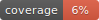

# Aplicación Médica - Registro de Peso e IMC

Aplicación web monousuario para el registro personal de peso, talla y cálculo del Índice de Masa Corporal (IMC).

## Características

- ✅ Registro de datos personales (nombre, apellidos, fecha de nacimiento, talla)
- ✅ Registro de peso con fecha y hora
- ✅ Cálculo automático de IMC con descripción detallada
- ✅ Estadísticas históricas (número de pesajes, peso máximo, peso mínimo)
- ✅ Sincronización bidireccional entre frontend y backend
- ✅ Validaciones defensivas en múltiples capas
- ✅ Modo offline (funciona sin conexión al servidor)
- ✅ Internacionalización (i18n)

## Arquitectura

- **Backend**: Flask (Python) con API REST
- **Frontend**: JavaScript vanilla con localStorage
- **Almacenamiento Backend**: Configurable entre:
  - Memoria (volátil, para pruebas)
  - SQLite (persistente, por defecto)
  - SQLCipher (persistente y cifrado)
- **Almacenamiento Frontend**: localStorage (persistente en el navegador)
- **WAF**: ModSecurity v3 + OWASP Core Rule Set (reverse proxy Nginx)
- **Tests**: 213 tests backend (pytest) + ~66 tests frontend (Jest)
- **DefectDojo**: Integrado para gestión de vulnerabilidades de seguridad
- **Supervisor**: Dashboard de desarrollo para monitoreo de tráfico API y base de datos

## Documentación

- Índice general: `docs/INDICE_DOCUMENTACION.md`
- Manual de usuario: `docs/manual.md`
- Requerimientos: `docs/requeriments.md`
- Seguridad (índice): `docs/SEGURIDAD.md`
- Informe ASVS: `docs/INFORME_SEGURIDAD.md`
- JWT + RBAC: `docs/JWT_RBAC_Integracion.md`
- OpenAPI: `docs/openapi.yaml`

## Instalación Rápida

### Requisitos Previos

- Docker y docker-compose instalados
- Git (para clonar el repositorio)
- Make (opcional, para usar comandos simplificados)

### Pasos de Instalación

1. **Clonar el repositorio**:
```bash
git clone <url-del-repositorio>
cd medical_register
```

2. **Ejecutar el script de configuración**:
```bash
./scripts/setup.sh
```

Este script:
- Crea los directorios necesarios para datos persistentes
- Verifica que Docker esté instalado
- Construye la imagen de la aplicación

3. **Configurar variables de entorno (recomendado)**:

El proyecto usa un archivo `.env` local (no se sube a GitHub) para configurar opciones y secretos. La aplicación carga el `.env` automáticamente (en Docker desde el entrypoint y en Python con python-dotenv desde la raíz del proyecto), por lo que no hace falta exportar las variables a mano.
Puedes partir del ejemplo:

```bash
cp docker-compose.env.example .env
```

Si trabajas en una ruta con espacios o caracteres especiales, asegúrate de mantener el `.env` con:

```env
COMPOSE_PROJECT_NAME=medical_register
COMPOSE_DOCKER_CLI_BUILD=0
DOCKER_BUILDKIT=0
```

Para activar reCAPTCHA v3 en login/registro, define en `.env`:

| Variable | Descripción |
|----------|-------------|
| `RECAPTCHA_SITE_KEY` | Clave pública de sitio (desde [reCAPTCHA Admin](https://www.google.com/recaptcha/admin)) |
| `RECAPTCHA_SECRET_KEY` | Clave secreta para verificación en servidor |
| `RECAPTCHA_MIN_SCORE` | (Opcional) Umbral de score 0.0–1.0; por defecto `0.5` |

En desarrollo local, añade `localhost` (y `127.0.0.1` si accedes por IP) a los dominios autorizados de tu clave en la consola de reCAPTCHA. Tras cambiar el `.env`, reinicia los contenedores (`make down` y `make`). Detalles en [Autenticación y contraseñas](docs/seguridad/02-autenticacion-contrasenas.md).

### Documentación de API (OpenAPI + Swagger UI)

La API expone documentación interactiva para pruebas y validación de entregables:

- **Swagger UI**: `http://localhost:5001/swagger`
- **OpenAPI YAML**: `http://localhost:5001/api/openapi.yaml`

Se puede desactivar en producción con:

```bash
API_DOCS_ENABLED=0
```

4. **Arrancar la aplicación**:

El proyecto ofrece múltiples opciones de arranque según tus necesidades:

#### Opciones de Arranque Básicas

**Aplicación principal (por defecto)**:
```bash
make default
# o simplemente
make
```
Arranca la aplicación principal con el backend de almacenamiento configurado por defecto (SQLite).

**Aplicación con almacenamiento en memoria**:
```bash
make memory
```
Arranca la aplicación sin base de datos persistente. Los datos se pierden al detener el contenedor. Útil para pruebas rápidas.

**Aplicación con base de datos persistente**:
```bash
make db
```
Arranca la aplicación con base de datos SQLite (o SQLCipher si está configurado). Los datos persisten entre reinicios.

**Aplicación + DefectDojo**:
```bash
make up
```
Arranca la aplicación principal junto con DefectDojo (sin findings iniciales).

#### Opciones de Desarrollo

**Modo supervisor (desarrollo)**:
```bash
make supervisor
```
Arranca la aplicación con el dashboard de supervisor activo. Permite monitorear el tráfico API y el estado de la base de datos en tiempo real.
- Aplicación: http://localhost:5001
- Supervisor: http://localhost:5001/supervisor

**Frontend local (simula offline)**:
```bash
make local
```
Arranca solo el frontend en modo local, simulando errores de comunicación con el servidor. Útil para probar el comportamiento offline del frontend.

#### Opciones con Docker Compose

Si prefieres usar `docker-compose` directamente:
```bash
# Aplicación principal (por defecto)
COMPOSE_DOCKER_CLI_BUILD=0 DOCKER_BUILDKIT=0 docker-compose up -d

# Con almacenamiento en memoria
STORAGE_BACKEND=memory COMPOSE_DOCKER_CLI_BUILD=0 DOCKER_BUILDKIT=0 docker-compose up -d

# Con base de datos
STORAGE_BACKEND=sqlite COMPOSE_DOCKER_CLI_BUILD=0 DOCKER_BUILDKIT=0 docker-compose up -d

# Con supervisor (desarrollo)
APP_SUPERVISOR=1 FLASK_ENV=development COMPOSE_DOCKER_CLI_BUILD=0 DOCKER_BUILDKIT=0 docker-compose up -d
```

> **Nota**: El proyecto incluye un `Makefile` que desactiva automáticamente BuildKit para evitar errores de gRPC. Se recomienda usar `make` para mayor compatibilidad.

4. **Arrancar DefectDojo (opcional)**:

**Opción A - Usando Make (recomendado)**:
```bash
# Arrancar solo DefectDojo (vacío, sin findings)
make initDefectDojo

# O arrancar aplicación + DefectDojo de una vez
make up
```

**Opción B - Usando docker-compose directamente**:
```bash
COMPOSE_DOCKER_CLI_BUILD=0 DOCKER_BUILDKIT=0 docker-compose --profile defectdojo up -d
```

**La inicialización es automática** al arrancar DefectDojo. El contenedor ejecuta:
- Migraciones de la base de datos (si son necesarias)
- Recolección de archivos estáticos
- Creación/verificación del usuario admin (admin/admin)

> **Nota**: El script `reset_defectdojo.sh` está disponible para hacer un reset manual si es necesario.

5. **Acceder a las aplicaciones**:
- **Aplicación Flask**: http://localhost:5001
- **DefectDojo**: http://localhost:8080
  - Usuario: `admin`
  - Contraseña: `admin`

## Validaciones Defensivas

La aplicación implementa validaciones defensivas en múltiples capas para garantizar la integridad de los datos:

### Backend
- Validación de límites antes de guardar datos (altura: 0.4-2.72m, peso: 2-650kg)
- Validación de variación de peso por día (máximo 5kg/día)
- **Validación defensiva antes de calcular IMC**: Verifica que los datos almacenados estén dentro de los límites antes de ejecutar funciones helper

### Frontend
- Validación en formularios antes de enviar datos
- **Validación defensiva antes de calcular IMC**: Verifica que los datos locales estén dentro de los límites antes de calcular
- Validación de variación de peso en tiempo real

## DefectDojo - Gestión de Vulnerabilidades

La aplicación incluye **DefectDojo** integrado, una plataforma open source para la gestión centralizada de vulnerabilidades de seguridad.

### Características de DefectDojo

- ✅ Gestión centralizada de vulnerabilidades
- ✅ Integración con más de 180 herramientas de seguridad (SAST, DAST, SCA)
- ✅ Priorización basada en riesgos
- ✅ Automatización de flujos de trabajo de seguridad
- ✅ Reportes y dashboards de seguridad

### Acceso a DefectDojo

1. **Desde la interfaz web**: Haz clic en el enlace "🔒 DefectDojo" en el header de la aplicación
2. **Acceso directo**: http://localhost:8080 (cuando los servicios estén ejecutándose)
3. **Aplicación Flask**: http://localhost:5001

### Iniciar DefectDojo

**Usando Make (recomendado)**:
```bash
# Iniciar solo DefectDojo (vacío, sin findings)
make initDefectDojo

# O arrancar aplicación + DefectDojo de una vez
make up

# Ver logs de DefectDojo
make logs-defectdojo

# Verificar estado de los servicios
make ps
```

**Usando docker-compose directamente**:
```bash
# Iniciar DefectDojo y sus dependencias
COMPOSE_DOCKER_CLI_BUILD=0 DOCKER_BUILDKIT=0 docker-compose --profile defectdojo up -d

# Ver logs de DefectDojo
COMPOSE_DOCKER_CLI_BUILD=0 DOCKER_BUILDKIT=0 docker-compose --profile defectdojo logs -f defectdojo

# Verificar estado de los servicios
COMPOSE_DOCKER_CLI_BUILD=0 DOCKER_BUILDKIT=0 docker-compose --profile defectdojo ps
```

> **Nota**: El script `reset_defectdojo.sh` está disponible para hacer un reset manual de DefectDojo si es necesario. La inicialización automática se ejecuta al arrancar el contenedor.

### Backends de Almacenamiento

La aplicación soporta tres backends de almacenamiento configurable mediante la variable de entorno `STORAGE_BACKEND`:

- **`memory`**: Almacenamiento en memoria (por defecto en tests). Los datos se pierden al reiniciar.
- **`sqlite`**: Base de datos SQLite persistente (por defecto en producción). Los datos se guardan en `data/app.db`.
- **`sqlcipher`**: Base de datos SQLite cifrada con SQLCipher. Requiere configurar `SQLCIPHER_KEY` o usar `PASSWORD_PEPPER` como clave.

Para cambiar el backend, usa la variable de entorno:
```bash
STORAGE_BACKEND=sqlite make db
STORAGE_BACKEND=sqlcipher make db
STORAGE_BACKEND=memory make memory
```

### Comandos Make Disponibles

El proyecto incluye un `Makefile` con comandos útiles. Para ver todos los comandos disponibles:

```bash
make help
```

#### Comandos de Arranque
- `make` o `make default` - Arrancar la aplicación principal (por defecto)
- `make memory` - Arrancar sin BD (almacenamiento en memoria)
- `make db` - Arrancar con BD (sqlite/sqlcipher)
- `make local` - Arrancar solo frontend (simula offline)
- `make supervisor` - Arrancar supervisor (modo desarrollo)
- `make up` - Arrancar aplicación principal + DefectDojo vacío
- `make initDefectDojo` - Iniciar solo DefectDojo vacío
- `make update` - Despliegue completo y actualización

#### Comandos de Gestión
- `make down` - Detener todos los contenedores
- `make logs` - Ver logs de la aplicación
- `make logs-waf` - Ver logs del WAF (ModSecurity)
- `make logs-defectdojo` - Ver logs de DefectDojo
- `make ps` - Ver estado de los contenedores
- `make build` - Construir imágenes de la aplicación

#### Comandos de Testing
- `make test` - Ejecutar todos los tests
- `make test-backend` - Ejecutar tests backend en contenedor
- `make test-frontend` - Ejecutar tests frontend en contenedor

#### Comandos de Limpieza
- `make clean-temp` - Limpiar archivos temporales
- `make clean-all` - Limpiar TODO (DESTRUCTIVO)
- `make purge` - Detener servicios y limpiar TODO (DESTRUCTIVO)

#### Comandos WSTG (solo en dev)
- `make sync-wstg` - Sincronizar findings WSTG
- `make wstg-status` - Estado de sincronización WSTG
- `make wstg-logs` - Ver logs del servicio WSTG

Para ver todos los comandos disponibles: `make help`

### Configuración

- **Puerto**: 8080 (DefectDojo), 5001 (Aplicación Flask)
- **Base de datos**: PostgreSQL 15 (puerto 5432)
- **Redis**: Puerto 6379 (cache y tareas asíncronas)
- **Datos persistentes**: Almacenados en `./data/` (directorios locales, no volúmenes Docker)
- **Credenciales DefectDojo por defecto**: 
  - Usuario: `admin`
  - Contraseña: `admin`
  - ⚠️ **Cambiar en producción**
- **Credenciales base de datos**: Ver `docker-compose.yml` (cambiar en producción)

Para más información, consulta la [documentación de integración de DefectDojo](docs/defectdojo/DEFECTDOJO_INTEGRATION.md).

## Coverage

<!-- Pytest Coverage Comment:Begin -->



<!-- Pytest Coverage Comment:End -->
