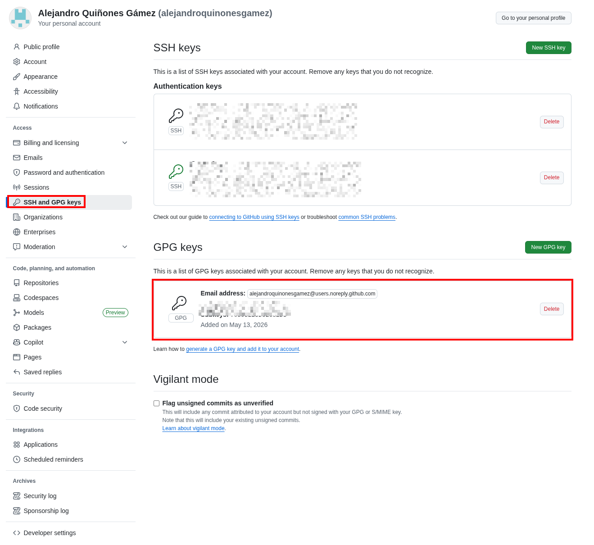
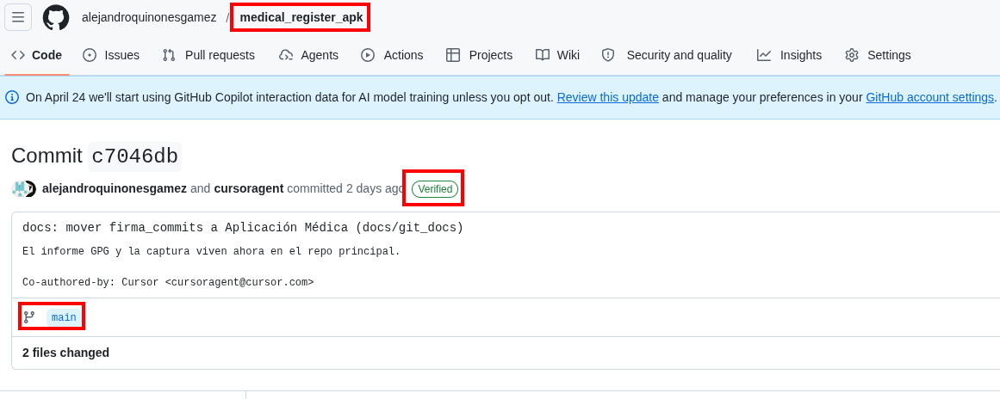
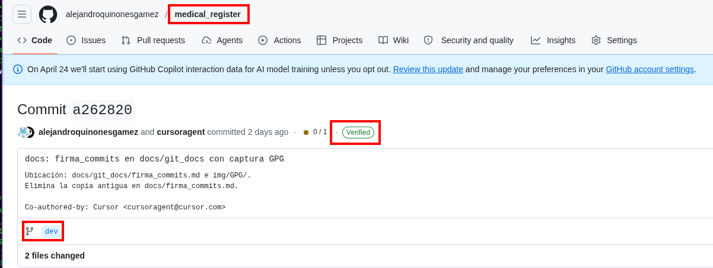
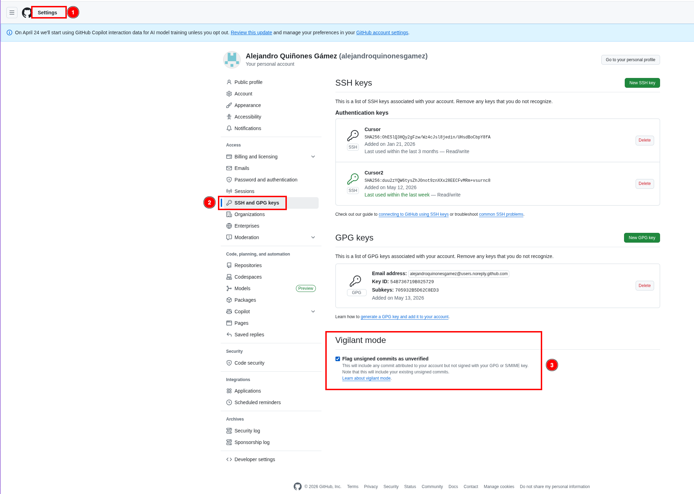

# Firma de commits con GPG

> Actividad PPS — Puesta a Producción Segura · Fernando Raya · 2026-04-20
>
> Objetivo: configurar la firma criptográfica de commits con GPG en los
> repositorios de la asignatura y demostrar que GitHub muestra el badge
> **"Verified"** en los commits firmados.
>
> **Ubicación:** `docs/git_docs/PPS_git/firma_commits.md` (repositorio *Aplicación Médica*).

**Autores**: Alejandro Quiñones Gámez & Adrián Bertos Gómez

**Asignatura**: PPS — Puesta a Producción Segura

**Curso**: Curso de Especialización en Ciberseguridad en Tecnologías de la Información

**Centro**: IES Zaidín-Vergeles

---

## Repositorios de este trabajo (espacio de trabajo PPS)

| Proyecto | Ruta local | Remoto `origin` (SSH) | Rama habitual |
|---|---|---|---|
| Cliente Android | `/home/alejandro/DriveLocal/alejandro/Ciberseguridad/PPS - Puesta a Producción Segura/medical_register_android` | `git@github.com:alejandroquinonesgamez/medical_register_apk.git` | `main` |
| Backend | `/home/alejandro/DriveLocal/alejandro/Ciberseguridad/PPS - Puesta a Producción Segura/Aplicación Médica` | `git@github.com:alejandroquinonesgamez/medical_register.git` | `dev` |

Si el remoto del Android no apunta al repo de la APK:

```bash
cd "/home/alejandro/DriveLocal/alejandro/Ciberseguridad/PPS - Puesta a Producción Segura/medical_register_android"
git remote set-url origin git@github.com:alejandroquinonesgamez/medical_register_apk.git
git remote -v
```

---

## 1. Introducción

La firma de commits añade dos garantías al control de versiones:

- **Autenticación**: el autor del commit es realmente quien dice ser.
- **Integridad**: el contenido del commit no se ha alterado después de la firma.

Sin firma, cualquiera puede ejecutar:

```bash
git config --global user.name  "Linus Torvalds"
git config --global user.email "torvalds@linux-foundation.org"
git commit -m "Backdoor"
```

…y Git aceptará ese commit como si fuera de Linus. Plataformas como GitHub
mostrarán el nombre y el email tal cual, sin validar nada.

La firma con GPG resuelve esto adhiriendo al commit un bloque PGP firmado con
la clave privada del autor. GitHub valida la firma contra la clave pública
subida a la cuenta y, si la verificación es correcta, muestra el badge
verde **`Verified`**.

Este documento recoge **paso a paso** la configuración realizada en los dos
proyectos de la asignatura, incluyendo la salida real de cada comando como
evidencia:

- Cliente Android: directorio `medical_register_android` → remoto GitHub **`medical_register_apk`**.
- Backend: directorio `Aplicación Médica` → remoto GitHub **`medical_register`**.

> **Nota (2026-05-14):** la documentación del `.gitignore` de ambos proyectos
> vive solo en `docs/gitignore.md` del backend; no forma parte de la
> configuración GPG, pero conviene tenerlo claro al entregar la práctica.
> Este informe de firma GPG y sus capturas viven bajo `docs/git_docs/PPS_git/`.

## 2. Estado inicial

### 2.1. Versiones de las herramientas

```text
$ gpg --version
gpg (GnuPG) 2.4.9
libgcrypt 1.12.2
Copyright (C) 2025 g10 Code GmbH

$ git --version
git version 2.54.0
```

### 2.2. No hay clave GPG previa

```text
$ gpg --list-secret-keys --keyid-format=LONG
(salida vacía → no existe clave privada en ~/.gnupg)
```

### 2.3. No hay configuración de firma en Git

```text
$ git config --global --get user.signingkey
$ git config --global --get commit.gpgsign
$ git config --global --get gpg.format
(las tres salidas son vacías → la firma de commits NO está activada)
```

### 2.4. Los commits anteriores no están firmados

Verificación con el placeholder `%G?` (estado de la firma):

```text
$ git log -n 5 --pretty=format:'%h %G? %s'
9b9e945 N  docs(MSTG-RES): sustituir guía por informe técnico
af32e8b N  docs(MSTG-RES): informe unificado, sin registro de cambios, PDF regenerado
f56b28e N  docs: regenerar MSTG_RESILIENCE.pdf (Pandoc + xelatex)
673ff71 N  chore: ignorar guion de capturas, script PDF y assets no usados
db1f37a N  docs: informe MSTG-RES en PDF, README de entrega y limpieza Play Integrity
```

La columna `%G?` muestra el estado de la firma:

| Letra | Significado |
|---|---|
| `G` | Firma válida (Good) |
| `B` | Firma mala (Bad) |
| `U` | Firma válida con confianza desconocida (Unknown) |
| `X` | Firma expirada (eXpired) |
| `Y` | Clave expirada |
| `R` | Clave revocada |
| `E` | Error al validar |
| `N` | **No hay firma** ← estado inicial |

## 3. Generación de la clave GPG

### 3.1. Decisiones tomadas

| Parámetro | Valor | Motivo |
|---|---|---|
| Algoritmo | **Ed25519** (EdDSA) | Recomendado por GitHub: moderno, claves cortas, firmas rápidas. |
| Subclave de cifrado | Curve25519 (ECDH) | Pareja natural de Ed25519 para cifrado. |
| Nombre | `Alejandro Quiñones` | Mismo nombre del autor que aparece en los commits actuales. |
| Email | `alejandroquinonesgamez@users.noreply.github.com` | Email *noreply* de GitHub. Evita exponer la dirección personal y es el que ya se usaba en commits. GitHub lo trata como verificado automáticamente para la cuenta. |
| Caducidad | Sin caducidad | Tal como sugiere el enunciado. La rotación se puede hacer manualmente cuando proceda. |
| Passphrase | Temporal (no versionar la real en informes públicos) | Solo para la práctica. Rotar a una passphrase robusta del gestor de contraseñas. |

### 3.2. Generación en modo batch

Para no depender de un TTY interactivo se usó `gpg --batch --generate-key`
con un fichero de instrucciones (`/tmp/gpg_batch.txt`) eliminado
inmediatamente después.

Contenido del batch (con la passphrase **redactada**):

```text
%echo Generando clave Ed25519 para Alejandro Quiñones
Key-Type: EDDSA
Key-Curve: ed25519
Key-Usage: sign
Subkey-Type: ECDH
Subkey-Curve: cv25519
Subkey-Usage: encrypt
Name-Real: Alejandro Quiñones
Name-Email: alejandroquinonesgamez@users.noreply.github.com
Expire-Date: 0
Passphrase: ***REDACTED***
%commit
%echo Clave generada
```

Ejecución:

```text
$ gpg --batch --pinentry-mode loopback --generate-key /tmp/gpg_batch.txt
gpg: Generando clave Ed25519 para Alejandro Quiñones
gpg: creado el directorio '/home/alejandro/.gnupg/openpgp-revocs.d'
gpg: certificado de revocación guardado como
     '/home/alejandro/.gnupg/openpgp-revocs.d/6DF65CE25E4CDA2BF3B0E38C54B736719B025729.rev'
gpg: Clave generada

$ rm -v /tmp/gpg_batch.txt
'/tmp/gpg_batch.txt' borrado
```

> **Importante**: GnuPG generó automáticamente un *certificado de revocación*
> en `~/.gnupg/openpgp-revocs.d/<fingerprint>.rev`. Conviene **moverlo fuera
> del equipo** (a un USB cifrado o un gestor de secretos) para poder revocar
> la clave si se compromete.

### 3.3. Verificación: la clave existe

```text
$ gpg --list-secret-keys --keyid-format=LONG
gpg: comprobando base de datos de confianza
gpg: marginals needed: 3  completes needed: 1  trust model: pgp
gpg: nivel: 0  validez:   1  firmada:   0  confianza: 0-, 0q, 0n, 0m, 0f, 1u
[keyboxd]
---------
sec   ed25519/54B736719B025729 2026-05-13 [SC]
      6DF65CE25E4CDA2BF3B0E38C54B736719B025729
uid              [  absoluta ] Alejandro Quiñones <alejandroquinonesgamez@users.noreply.github.com>
ssb   cv25519/705932B5D62C8ED3 2026-05-13 [E]
```

Datos relevantes que se extraen de la salida:

| Concepto | Valor |
|---|---|
| **ID corto (8 bytes)** | `54B736719B025729` |
| **Fingerprint (20 bytes)** | `6DF6 5CE2 5E4C DA2B F3B0  E38C 54B7 3671 9B02 5729` |
| Algoritmo | `ed25519` (firma) + `cv25519` (cifrado) |
| Capacidades | `[SC]` Sign + Certify · `[E]` Encrypt |
| Caducidad | sin caducidad |
| Confianza | `absoluta` (la propia del usuario) |

```text
$ gpg --fingerprint 54B736719B025729
pub   ed25519 2026-05-13 [SC]
      6DF6 5CE2 5E4C DA2B F3B0  E38C 54B7 3671 9B02 5729
uid        [  absoluta ] Alejandro Quiñones <alejandroquinonesgamez@users.noreply.github.com>
sub   cv25519 2026-05-13 [E]
```

## 4. Configurar gpg-agent para uso no interactivo

Por defecto `gpg-agent` lanza un cuadro de diálogo gráfico (`pinentry-gtk`)
para pedir la passphrase. En esta sesión necesito que la passphrase se pueda
introducir por *loopback* (texto plano desde stdin) y que se cachee durante
toda la jornada, así que ajusto los ficheros de configuración del agente:

```text
$ cat ~/.gnupg/gpg-agent.conf
default-cache-ttl 28800     # 8 horas
max-cache-ttl 28800
allow-loopback-pinentry

$ cat ~/.gnupg/gpg.conf
use-agent
pinentry-mode loopback

$ gpgconf --kill gpg-agent
$ gpg-connect-agent /bye    # arranca el agente con la nueva config
```

Firma de prueba para precachear la passphrase en el agente:

```text
$ echo "test sign" | gpg --batch --pinentry-mode loopback \
                         --passphrase "***REDACTED***" \
                         --local-user 54B736719B025729 --clearsign
-----BEGIN PGP SIGNED MESSAGE-----
Hash: SHA512

test sign

-----BEGIN PGP SIGNATURE-----

iHUEARYKAB0WIQRt9lziXkzaK/Ow44xUtzZxmwJXKQUCagTIaAAKCRBUtzZxmwJX
KQy3AQDLnh8nDkkED8EpXGKFeHDzZigKYEukNgVZE0fAzvcapgEAvirgo8H+yuC8
I1Sw0ljGvN6DAHiXEysX8je1rWrFrwE=
=R0Fr
-----END PGP SIGNATURE-----
```

La firma sale en texto plano, lo que confirma que **la clave funciona**.

## 5. Configurar Git para usar la clave

### 5.1. Configuración global

```bash
# ID de la clave de firma
git config --global user.signingkey 54B736719B025729

# Firmar TODOS los commits automáticamente
git config --global commit.gpgsign true

# Firmar también las etiquetas (tags)
git config --global tag.gpgsign true

# Binario de GPG (por si hay más de uno instalado)
git config --global gpg.program /usr/bin/gpg

# Identidad para los commits (tiene que coincidir con un UID de la clave)
git config --global user.name  "Alejandro Quiñones"
git config --global user.email "alejandroquinonesgamez@users.noreply.github.com"
```

Comprobación:

```text
$ git config --global --get user.signingkey
54B736719B025729
$ git config --global --get commit.gpgsign
true
$ git config --global --get tag.gpgsign
true
$ git config --global --get gpg.program
/usr/bin/gpg
$ git config --global --get user.name
Alejandro Quiñones
$ git config --global --get user.email
alejandroquinonesgamez@users.noreply.github.com
```

### 5.2. Ajuste local en `Aplicación Médica`

El repositorio `Aplicación Médica` tenía configurado localmente
`user.email = alejandroquinonesgamez@gmail.com` (anulando la global). Como el
UID de la clave es el email *noreply*, GitHub solo marcará `Verified` si el
**email del commit coincide con un UID de la clave** subida. Por tanto se
ajusta también la config local de ese repo:

```text
$ # Antes
$ git config user.email
alejandroquinonesgamez@gmail.com

$ git config user.email alejandroquinonesgamez@users.noreply.github.com
$ git config user.name  "Alejandro Quiñones"

$ # Después
$ git config user.email
alejandroquinonesgamez@users.noreply.github.com
$ git config user.signingkey
54B736719B025729
$ git config commit.gpgsign
true
```

> Alternativa: añadir un UID adicional a la clave con el email `@gmail.com`
> y verificar ese email también en GitHub. Para esta práctica se ha optado
> por la solución más simple: un único UID `noreply`.

## 6. Exportar la clave pública y subirla a GitHub

Para que GitHub valide las firmas, necesita la **clave pública**.

```text
$ gpg --armor --export 54B736719B025729
-----BEGIN PGP PUBLIC KEY BLOCK-----

mDMEagTIQhYJKwYBBAHaRw8BAQdAPBDSV0b8KmZtJ9tqoaESr37Z6f/AOO/V0qfW
IHT82o+0RUFsZWphbmRybyBRdWnDsW9uZXMgPGFsZWphbmRyb3F1aW5vbmVzZ2Ft
ZXpAdXNlcnMubm9yZXBseS5naXRodWIuY29tPoiQBBMWCgA4FiEEbfZc4l5M2ivz
sOOMVLc2cZsCVykFAmoEyEICGwMFCwkIBwIGFQoJCAsCBBYCAwECHgECF4AACgkQ
VLc2cZsCVylNkgEAmdTH7bVxcAYNR6sNL52SZWJCnWn+TnQErmFyLmuMmVoA/iL4
7PQzEQoThFXtogYV78oE55SIGR1PUx+h9bQQ9NwIuDgEagTIQhIKKwYBBAGXVQEF
AQEHQOoPQoBeG8tT7mgkAD24Hgfv7Vcy1GtMoZm7P/NxGSkCAwEIB4h4BBgWCgAg
FiEEbfZc4l5M2ivzsOOMVLc2cZsCVykFAmoEyEICGwwACgkQVLc2cZsCVykTIAD9
HYf5cJ6XcA94YHOyBrCbpjM3JwS1549MFFmhZqsoUvMA/3q2+/Rh4vM053walKQi
gazekJ++oAO0z6QFwXC87DUE
=ROuP
-----END PGP PUBLIC KEY BLOCK-----
```

Pasos en GitHub:

1. Entrar en **Settings → Access → SSH and GPG keys → New GPG key**.
2. Pegar todo el bloque anterior (incluidas las líneas
   `-----BEGIN PGP PUBLIC KEY BLOCK-----` y `-----END PGP PUBLIC KEY BLOCK-----`).
3. Guardar.

Para comprobar después que GitHub ya tiene la clave:

```bash
gh api user/gpg_keys --jq '.[] | {name: .name, key_id: .key_id, emails: .emails}'
```

## 7. Hacer commits firmados

Con `commit.gpgsign = true` en la configuración global, **cualquier `git
commit`** lo firmará automáticamente. No hace falta el flag `-S`.

### 7.1. Commit firmado en `medical_register_android`

```text
$ git add docs/gitignore.md

$ git commit -m "docs: añadir gitignore.md documentando ambos proyectos

Documenta el contenido del .gitignore de medical_register_android y de
Aplicación Médica, con justificación por bloques y comparativa.

Ejercicio PPS .gitignore (Fernando Raya, 2026-04-20)."
[main 4f4c9f5] docs: añadir gitignore.md documentando ambos proyectos
 1 file changed, 289 insertions(+)
 create mode 100644 docs/gitignore.md
```

Verificación con `git log --show-signature`:

```text
$ git log --show-signature -n 1
commit 4f4c9f587a6bf4dfba390964af005c471bc9f60a
gpg: Firmado el mié 13 may 2026 20:53:04 CEST
gpg:                usando EDDSA clave 6DF65CE25E4CDA2BF3B0E38C54B736719B025729
gpg: Firma correcta de "Alejandro Quiñones <alejandroquinonesgamez@users.noreply.github.com>" [absoluta]
Author: Alejandro Quiñones <alejandroquinonesgamez@users.noreply.github.com>
Date:   Wed May 13 20:53:04 2026 +0200

    docs: añadir gitignore.md documentando ambos proyectos
```

Verificación rápida con `%G?`:

```text
$ git log -n 5 --pretty=format:'%h %G? %s'
4f4c9f5 G docs: añadir gitignore.md documentando ambos proyectos   ← firma OK
9b9e945 N docs(MSTG-RES): sustituir guía por informe técnico
af32e8b N docs(MSTG-RES): informe unificado, sin registro de cambios, PDF regenerado
f56b28e N docs: regenerar MSTG_RESILIENCE.pdf (Pandoc + xelatex)
673ff71 N chore: ignorar guion de capturas, script PDF y assets no usados
```

El commit `4f4c9f5` pasa de `N` (sin firma) a **`G`** (firma válida).

### 7.2. Commit firmado en `Aplicación Médica`

Antes del commit hubo que igualar el `user.email` local al UID de la clave
(ver §5.2). Tras eso:

```text
$ git add docs/gitignore.md       # solo el fichero nuevo, sin tocar WIP

$ git commit -m "docs: añadir gitignore.md documentando ambos proyectos

Documenta el contenido del .gitignore de medical_register_android y de
Aplicación Médica, con justificación por bloques y comparativa.

Ejercicio PPS .gitignore (Fernando Raya, 2026-04-20)."
[dev 65fc9cc] docs: añadir gitignore.md documentando ambos proyectos
 1 file changed, 289 insertions(+)
 create mode 100644 docs/gitignore.md
```

Verificación:

```text
$ git log --show-signature -n 1
commit 65fc9ccd6ef199d10847417ceed28e5062443584
gpg: Firmado el mié 13 may 2026 20:53:44 CEST
gpg:                usando EDDSA clave 6DF65CE25E4CDA2BF3B0E38C54B736719B025729
gpg: Firma correcta de "Alejandro Quiñones <alejandroquinonesgamez@users.noreply.github.com>" [absoluta]
Author: Alejandro Quiñones <alejandroquinonesgamez@users.noreply.github.com>
Date:   Wed May 13 20:53:44 2026 +0200

    docs: añadir gitignore.md documentando ambos proyectos
```

```text
$ git log -n 5 --pretty=format:'%h %G? %s'
65fc9cc G docs: añadir gitignore.md documentando ambos proyectos   ← firma OK
64d6a4e N Docker: soporte Compose v2/v1, base ECR y WAF con DNS dinámico
d80b1db N docs: limpiar archivos legacy duplicados en capturas y PDFs
6b3dd91 N fix(docker): evitar fallo de entrypoint en Windows con bind mount
dae5bf3 N chore: normalizar permisos de scripts
```

El commit `65fc9cc` también queda con **`G`**.

## 8. Push a GitHub y badge "Verified"

Una vez subida la clave pública a GitHub (§6), basta con hacer `git push` en
ambos repos:

```bash
# Cliente Android → GitHub medical_register_apk (rama main)
cd "/home/alejandro/DriveLocal/alejandro/Ciberseguridad/PPS - Puesta a Producción Segura/medical_register_android"
git push origin main

# Backend → GitHub medical_register (rama dev)
cd "/home/alejandro/DriveLocal/alejandro/Ciberseguridad/PPS - Puesta a Producción Segura/Aplicación Médica"
git push origin dev
```

GitHub validará la firma y, junto al hash corto del commit, mostrará un
badge verde **`Verified`**. Al pulsarlo, se despliega un panel con:

```
This commit was signed with the committer’s verified signature.
Signed by: Alejandro Quiñones
GPG key ID: 54B736719B025729
```

### 8.1. Evidencia visual (capturas)

Las capturas se almacenan bajo `docs/git_docs/img/` (ver también §11).

| Archivo | Qué demuestra |
|---|---|
| `img/GPG/GPG_created.png` | Clave GPG pública registrada en la cuenta GitHub (**Settings → SSH and GPG keys**). |
| `img/PPS_git/GPG/verified_android.png` | Commit en el remoto **`medical_register_apk`** (rama `main`) con badge **Verified**. |
| `img/PPS_git/GPG/verified_appmedica.png` | Commit en el remoto **`medical_register`** (rama `dev`) con badge **Verified**. |







## 9. Buenas prácticas y "Vigilant Mode"

GitHub ofrece un modo avanzado en **Settings → Code, planning, and
automation → SSH and GPG keys → Flag unsigned commits as unverified**
(*Vigilant Mode*).

- **Sin Vigilant Mode**: los commits firmados llevan badge `Verified`; los no
  firmados aparecen sin badge.
- **Con Vigilant Mode**: los firmados llevan `Verified` y los no firmados
  aparecen explícitamente como **`Unverified`**, lo que hace que cualquier
  commit sospechoso destaque.

Se recomienda **activarlo** en cuentas de alto perfil (mantenedores,
profesores, alumnos que entregan código).

En esta entrega se ha activado y queda documentado en la captura siguiente.



### Limitaciones de la firma de commits

- **Solo prueba quién firmó**, no qué se hizo. Un atacante con tu clave puede
  firmar lo que quiera. Por eso la *passphrase* y el certificado de
  revocación son críticos.
- **No es protección contra exfiltración**: si la clave privada se filtra,
  hay que revocarla (`gpg --gen-revoke`) y subir el certificado a GitHub
  o a un keyserver.
- **`.gitignore` y firma se complementan**: el primero evita subir
  secretos; la segunda evita suplantaciones. Idealmente se combinan con
  `pre-commit` (gitleaks, ruff) y CI/CD que rechace commits no firmados.

## 10. Resumen de evidencias

| Hito | Comando | Salida clave | Estado |
|---|---|---|---|
| 1. Generar clave | `gpg --batch --generate-key ...` | `gpg: Clave generada` | ✅ |
| 2. Listar clave | `gpg --list-secret-keys --keyid-format=LONG` | `sec ed25519/54B736719B025729` | ✅ |
| 3. Config Git | `git config --global user.signingkey 54B736719B025729` + `commit.gpgsign true` | | ✅ |
| 4. Commit Android | `git commit -m "docs: añadir gitignore.md ..."` | commit `4f4c9f5` con `%G? = G` | ✅ |
| 5. Commit App Médica | `git commit -m "docs: añadir gitignore.md ..."` | commit `65fc9cc` con `%G? = G` | ✅ |
| 6. Subir clave a GitHub | UI web *Settings → SSH and GPG keys* | `img/GPG/GPG_created.png` | ✅ |
| 7. Push y verificación en GitHub | `git push` + commit en la UI | `verified_android.png`, `verified_appmedica.png` | ✅ |
| 8. Vigilant Mode | Cuenta GitHub → *Flag unsigned commits as unverified* | `img/PPS_git/GPG/vigilant-mode.png` | ✅ |

---

## 11. Evidencias (entrega) — Apartado 1: firma de commits

Resumen de material gráfico incluido en el repositorio del backend (*Aplicación Médica*), enlazado desde este informe.

| # | Evidencia | Repositorio / ámbito | Ruta del fichero |
|---|-----------|----------------------|------------------|
| 1 | Clave GPG asociada a la cuenta | Cuenta GitHub | [`../img/GPG/GPG_created.png`](../img/GPG/GPG_created.png) |
| 2 | Commit firmado visible en remoto | `alejandroquinonesgamez/medical_register_apk` · rama `main` | [`../img/PPS_git/GPG/verified_android.png`](../img/PPS_git/GPG/verified_android.png) |
| 3 | Commit firmado visible en remoto | `alejandroquinonesgamez/medical_register` · rama `dev` | [`../img/PPS_git/GPG/verified_appmedica.png`](../img/PPS_git/GPG/verified_appmedica.png) |
| 4 | Vigilant Mode | Cuenta GitHub | [`../img/PPS_git/GPG/vigilant-mode.png`](../img/PPS_git/GPG/vigilant-mode.png) |

**Complemento local** (sin captura): verificación con `git log --show-signature` y `%G? = G` en los commits firmados (§7 y tabla anterior).

**Guía operativa**: [`pasos.md`](pasos.md) §1.

**Documentos relacionados (PPS Git)**: [`github.md`](github.md), [`gitleaks.md`](gitleaks.md), [`proteccion-ramas.md`](proteccion-ramas.md), [`semgrep.md`](semgrep.md), [`gitignore.md`](gitignore.md).

---

**Autores**: Alejandro Quiñones Gámez & Adrián Bertos Gómez

**Asignatura**: PPS — Puesta a Producción Segura

**Curso**: Curso de Especialización en Ciberseguridad en Tecnologías de la Información

**Centro**: IES Zaidín-Vergeles

**Ejercicio**: Firma de commits (Fernando Raya, 2026-04-20)
