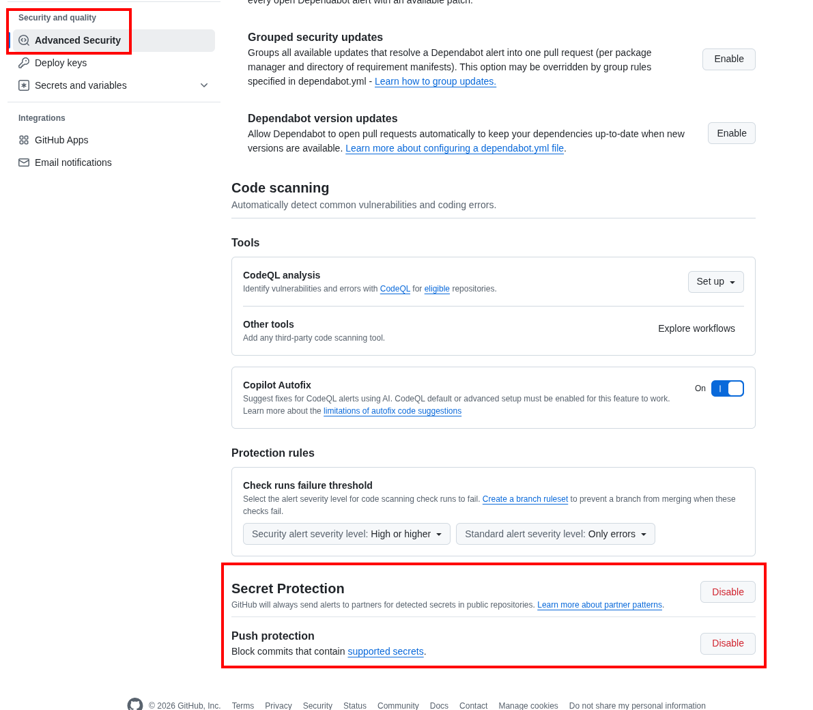
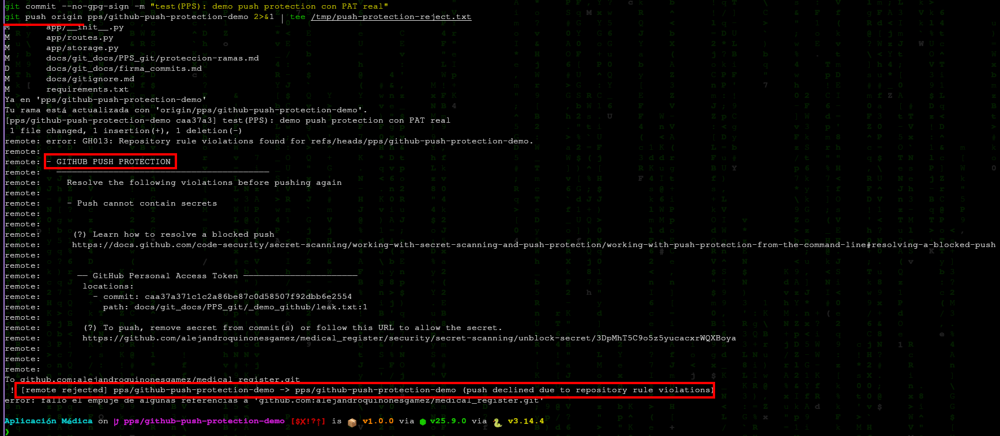

# GitHub — Secret Scanning y Push Protection

**Autores**: Alejandro Quiñones Gámez & Adrián Bertos Gómez

**Asignatura**: PPS — Puesta a Producción Segura

**Curso**: Curso de Especialización en Ciberseguridad en Tecnologías de la Información

**Centro**: IES Zaidín-Vergeles

**Enunciado**: `docs/git_docs/PPS_git/github.html` (Fernando Raya, 2026-04-20)

---

## Repositorios de este trabajo

Las pruebas de GitHub (secret scanning, push protection, reglas de rama, Actions) se documentan sobre los **dos repositorios** del curso:

| Proyecto | Repositorio GitHub | Remoto `origin` (SSH) | Rama habitual |
|---|---|---|---|
| Cliente Android (APK) | [medical_register_apk](https://github.com/alejandroquinonesgamez/medical_register_apk) | `git@github.com:alejandroquinonesgamez/medical_register_apk.git` | `main` |
| Backend | [medical_register](https://github.com/alejandroquinonesgamez/medical_register) | `git@github.com:alejandroquinonesgamez/medical_register.git` | `dev` |

Fijar o comprobar el remoto del Android:

```bash
git clone git@github.com:alejandroquinonesgamez/medical_register_apk.git
cd medical_register_apk
git remote set-url origin git@github.com:alejandroquinonesgamez/medical_register_apk.git
git remote -v
git push origin main
```

Backend (documentación y workflows en este repositorio):

```bash
# Raíz del clone de medical_register
git remote -v
git push origin dev
```

> Cada repositorio en GitHub tiene su propia pestaña **Settings** / **Security**; repite la configuración en `medical_register_apk` y en `medical_register` si la práctica lo exige en ambos.

---

## 1. Introducción

En el desarrollo moderno, la filtración accidental de credenciales es un riesgo crítico. GitHub ofrece dos mecanismos nativos complementarios:

| Mecanismo | Momento | Objetivo |
|---|---|---|
| **Secret scanning** | Tras el código ya en el remoto | Detectar secretos *en reposo*, alertar y (con proveedores asociados) facilitar la revocación. |
| **Push protection** | En el `git push` | **Bloquear** antes de que el secreto entre en el historial público o compartido. |

Este documento resume la teoría del enunciado y propone una **resolución práctica** documentable: activación, gestión de alertas, simulación controlada de fuga y prueba de bloqueo en push.

Referencias oficiales:

- [About secret scanning](https://docs.github.com/en/code-security/secret-scanning/about-secret-scanning)
- [Remediating a leaked secret](https://docs.github.com/es/code-security/tutorials/remediate-leaked-secrets/remediating-a-leaked-secret)
- [Enabling push protection for your repository](https://docs.github.com/en/code-security/how-tos/secure-your-secrets/prevent-future-leaks/enabling-push-protection-for-your-repository)

---

## 2. Secret scanning (escaneo de secretos)

### 2.1. Qué hace

GitHub analiza el contenido del repositorio (incluido el historial en los planes que lo permiten) buscando patrones de **más de doscientos proveedores** (AWS, Google Cloud, Stripe, OpenAI, etc.). En repositorios **públicos** suele estar activo de forma predeterminada y es gratuito. En **privados**, puede requerir activación manual o políticas de organización / Enterprise.

Si el token pertenece a un proveedor colaborador, GitHub puede notificar al proveedor para que **revoque o invalide** el secreto, reduciendo la ventana de abuso.

### 2.2. Gestión de alertas

Cuando se detecta un posible secreto ya presente en el repo, la alerta se puede cerrar de tres maneras (según el enunciado):

| Cierre | Cuándo usarlo |
|---|---|
| **Resolved as real secret** | Era material real: se revoca/rotación de credencial y se limpia el código (y el historial si hace falta). |
| **Used in tests** | Es un valor ficticio usado solo en pruebas (idealmente con patrones que no colisionen con producción). |
| **False positive** | El patrón coincide pero no es un secreto (p. ej. un identificador con formato parecido). |

### 2.3. Actividad: simular una filtración y remediar (entorno seguro)

**No** uses una clave real de producción. El procedimiento documentable es:

1. **Preparar un token de prueba revocable**  
   Por ejemplo, un Personal Access Token de GitHub con permisos mínimos y caducidad de un día, o un secreto de un servicio de *sandbox* que puedas invalidar al instante.

2. **Introducirlo en una rama de prueba** en un fichero que luego borrarás (p. ej. `tmp/leak-demo.txt`). Haz commit **solo en un fork o repo de práctica**, no en un remoto compartido con datos reales.

3. **Comprobar la alerta** en **Security → Secret scanning** (o el nombre equivalente según la UI actual).

4. **Remediar** siguiendo la guía oficial [Remediating a leaked secret](https://docs.github.com/es/code-security/tutorials/remediate-leaked-secrets/remediating-a-leaked-secret):

   - Revocar el secreto en el origen (GitHub / consola del proveedor).
   - Eliminar el secreto del árbol de trabajo y del historial si ya se hizo push a ramas compartidas (p. ej. `git filter-repo` o BFG; en ramas no fusionadas puede bastar con borrar la rama remota).

5. **Cerrar la alerta** en GitHub con el motivo correcto y **documentar** capturas: alerta abierta, revocación en el proveedor, commit de limpieza, alerta cerrada.

> En un repositorio académico sin GitHub Advanced Security en privado, algunas opciones pueden no estar disponibles; en ese caso documenta la limitación y adjunta capturas de la documentación de GitHub sobre qué habilitaría un administrador.

---

## 3. Push protection

### 3.1. Diferencia respecto al escaneo clásico

El escaneo *reactivo* encuentra el problema cuando el secreto **ya está** en el remoto. **Push protection** intercepta el `git push` en los servidores de GitHub, analiza los cambios y **rechaza** el envío si detecta un patrón de alta confianza.

Flujo resumido:

1. **Escaneo** de los blobs que se intentan subir.  
2. **Detección** de coincidencias con patrones de proveedores o (en Enterprise) patrones personalizados.  
3. **Bloqueo** del push con mensaje en la terminal y enlace para gestionar la incidencia.

### 3.2. Tipos de protección

- **Partner patterns**: patrones validados con proveedores (alta confianza).  
- **Custom patterns** (GitHub Enterprise): expresiones regulares propias de la organización (tokens internos, prefijos corporativos, etc.).

### 3.3. Bypass y auditoría

Si el bloqueo es un falso positivo o un secreto de test, la interfaz o la CLI permiten indicar el motivo, por ejemplo:

- *Used in tests*  
- *False positive*  
- *Will fix later* (desaconsejado salvo excepción, queda trazabilidad)

Cada bypass genera **registro** para administración: alertas en **Security → Secret scanning** como *Bypassed*, notificaciones por email, etc.

### 3.4. Beneficios (resumen del enunciado)

- **Prevención real**: el secreto no llega al servidor.  
- **Ahorro de tiempo**: evita horas de limpieza de historial.  
- **Cultura de seguridad**: feedback inmediato al desarrollador.  
- **Cumplimiento**: evidencia de control sobre credenciales (SOC 2, ISO 27001, etc.).

### 3.5. Actividad: habilitar Push protection y documentar una prueba

1. En el repositorio: **Settings → Advanced Security** (o *Code security and analysis*).  
2. Activar **Secret Protection** y **Push protection** según [Enabling push protection for your repository](https://docs.github.com/en/code-security/how-tos/secure-your-secrets/prevent-future-leaks/enabling-push-protection-for-your-repository).

   

3. Crear un **PAT de prueba** (caducidad 1 día) y un commit con el token en un fichero de demo.  
4. `git push` debe ser **rechazado** (`GH013`, *Push cannot contain secrets*).  
5. Revocar el PAT, eliminar el fichero del commit y no usar *bypass* en producción.

#### PAT de prueba: permisos mínimos

El token **no se usa** para llamar a la API; solo debe tener formato válido (`ghp_...` o `github_pat_...`) para que Push protection lo detecte.

| Tipo de token | Scopes / permisos recomendados |
|---|---|
| **Fine-grained** | Repositorio solo `medical_register`; caducidad **1 día**; permisos mínimos (p. ej. **Metadata: Read-only**) o sin permisos de contenido |
| **Classic** | **Ningún scope** marcado; caducidad **1 día** |

Tras la demo: **revocar** el PAT en *Developer settings → Personal access tokens*.

#### Comandos usados en `medical_register`

```bash
# Raíz del clone de medical_register
git checkout dev && git pull origin dev
git checkout -b pps/github-push-protection-demo

mkdir -p docs/git_docs/PPS_git/_demo_github
printf '%s\n' 'ghp_...' > docs/git_docs/PPS_git/_demo_github/leak.txt   # PAT real de prueba

git add docs/git_docs/PPS_git/_demo_github/leak.txt
git commit --no-gpg-sign -m "test(PPS): demo push protection con PAT real"
git push -u origin pps/github-push-protection-demo
```

Resultado esperado en terminal: `GH013`, *GITHUB PUSH PROTECTION*, *GitHub Personal Access Token*, ruta `docs/git_docs/PPS_git/_demo_github/leak.txt`.



Repositorio de la prueba: **`alejandroquinonesgamez/medical_register`**. Rama: `pps/github-push-protection-demo`.

GitHub impidió que el PAT entrara en el historial remoto (**GH013**). La remediación correcta es **revocar** el token de prueba (aunque el push fallara) y no confiar en borrar el fichero local sin rotación.

Con *push protection* activo el secreto **no llega al remoto**, por lo que **no** suele generarse alerta en *Secret scanning*. No se aportan capturas `alerta-abierta` / `alerta-cerrada`: la evidencia del control es la configuración (paso 2) y el rechazo del push. El PAT de prueba usado en la demo **caducó o fue revocado** tras el ejercicio.

---

## 4. Relación con los proyectos del espacio de trabajo

- **Backend** (`medical_register`, rama `dev`): en `.github/workflows/` existen `coverage.yml` y `build-docs.yml`. La protección de ramas (véase `proteccion-ramas.md`) puede exigir que esos checks pasen antes de fusionar.
- **Android** (`medical_register_apk`, rama `main`): si añades Actions allí, los nombres de los checks aparecerán en la UI de GitHub de ese repo.

Push protection y Secret scanning son independientes de los *status checks* (secretos frente a calidad de código).

---

**Autores**: Alejandro Quiñones Gámez & Adrián Bertos Gómez

**Asignatura**: PPS — Puesta a Producción Segura

**Curso**: Curso de Especialización en Ciberseguridad en Tecnologías de la Información

**Centro**: IES Zaidín-Vergeles
