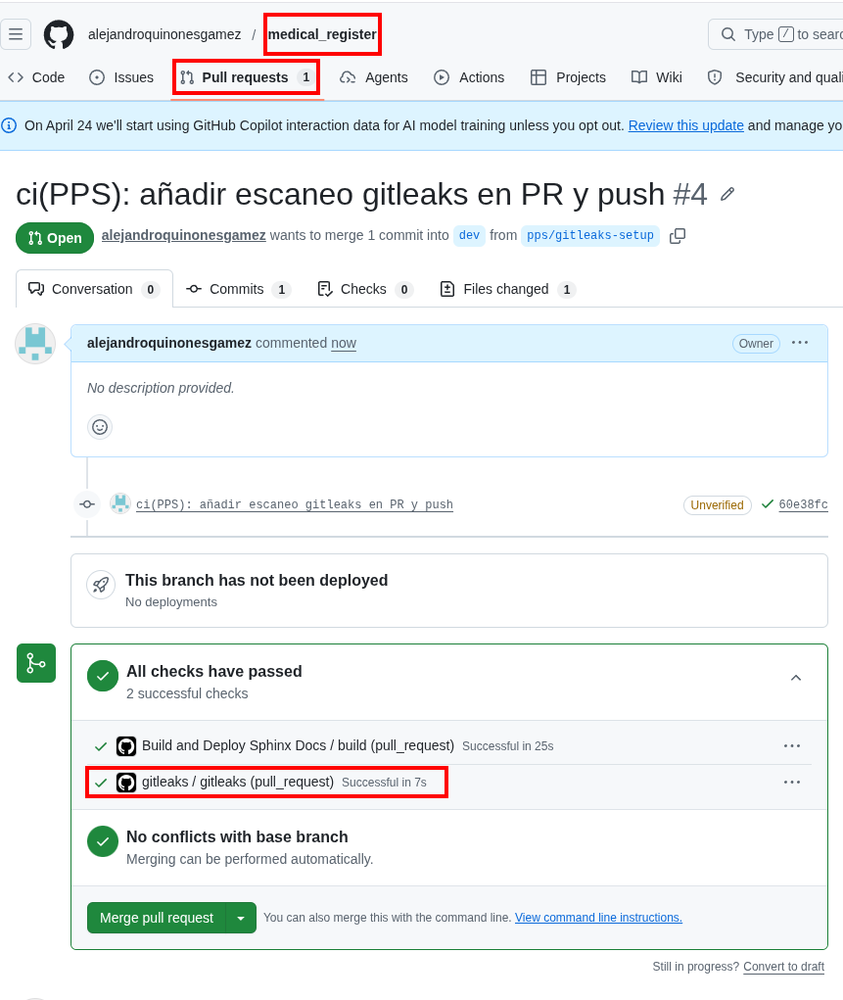
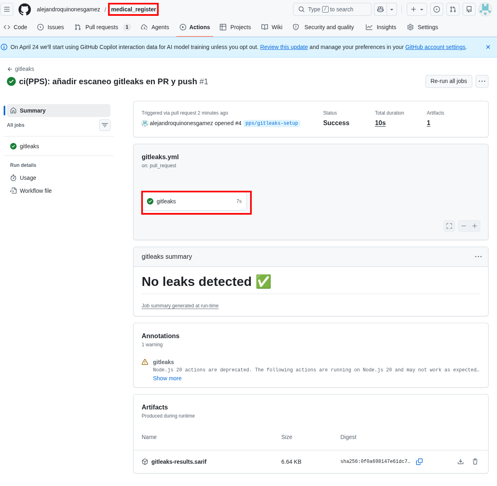
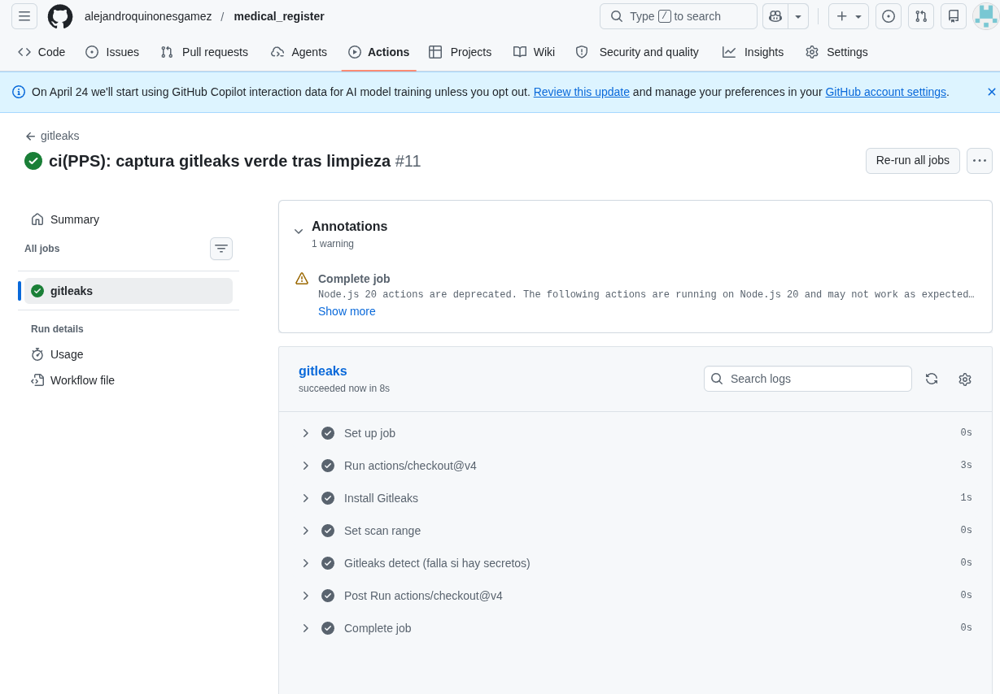

# Gitleaks — Escaneo de secretos en Git y CI

**Autores**: Alejandro Quiñones Gámez & Adrián Bertos Gómez

**Asignatura**: PPS — Puesta a Producción Segura

**Curso**: Curso de Especialización en Ciberseguridad en Tecnologías de la Información

**Centro**: IES Zaidín-Vergeles

---

## Repositorios de este trabajo

| Proyecto | Repositorio GitHub | Remoto `origin` (SSH) | Rama habitual |
|---|---|---|---|
| Cliente Android | [medical_register_apk](https://github.com/alejandroquinonesgamez/medical_register_apk) | `git@github.com:alejandroquinonesgamez/medical_register_apk.git` | `main` |
| Backend | [medical_register](https://github.com/alejandroquinonesgamez/medical_register) | `git@github.com:alejandroquinonesgamez/medical_register.git` | `dev` |

El workflow de ejemplo del §4 conviene añadirlo en el repo donde tengáis CI (normalmente el **backend**). Escaneo local: ejecutar `gitleaks detect` desde la raíz del clone.

```bash
# Raíz del clone de medical_register
gitleaks detect --verbose
```

---

## 1. Qué es Gitleaks

[Gitleaks](https://github.com/gitleaks/gitleaks) es una herramienta de código abierto orientada a **detectar secretos** (contraseñas, claves API, tokens) en repositorios Git. Combina reglas basadas en **expresiones regulares** con heurísticas de **entropía** para reducir ruido.

Encaja en la categoría amplia de análisis estático orientado a seguridad; se puede ejecutar:

- En **local** (incluido hook *pre-commit*) para no ensuciar el historial.  
- En **CI/CD** (p. ej. GitHub Actions) para rechazar merges o pushes con fugas.

Referencias del enunciado:

- [gitleaks — Pre-commit](https://github.com/gitleaks/gitleaks#pre-commit)  
- [Creating a baseline](https://github.com/gitleaks/gitleaks#creating-a-baseline)  
- [Pre-commit hook](https://github.com/gitleaks/gitleaks#pre-commit-hook)  
- [gitleaks-action](https://github.com/gitleaks/gitleaks-action)

---

## 2. Si Gitleaks detecta algo

| Paso | Acción |
|---|---|
| 1 | **Invalidar** el secreto en el origen (rotación / revocación). Un `git revert` o borrar el archivo **no** borra el compromiso si ya hubo push. |
| 2 | **Eliminar** el secreto del historial si llegó al remoto compartido (`git filter-repo`, BFG Repo-Cleaner), siguiendo la política del equipo. |
| 3 | Añadir patrones a `.gitignore` / gestores de secretos y **reglas** en CI para que no vuelva a ocurrir. |

---

## 3. Beneficios en equipo

- Reduce riesgo legal y operativo (filtraciones a nube pública).  
- Educa a usar variables de entorno y **GitHub Secrets** en lugar de literales.  
- Deja **auditoría** de que el pipeline exige escaneo.

---

## 4. Automatización con GitHub Actions

El enunciado propone un workflow mínimo. Adaptación recomendada para este monorepo (`.github/workflows/gitleaks.yml`):

```yaml
name: gitleaks

on:
  pull_request:
  push:
    branches: [main, master, dev]

jobs:
  scan:
    name: gitleaks
    runs-on: ubuntu-latest
    steps:
      - uses: actions/checkout@v4
        with:
          fetch-depth: 0
      - uses: gitleaks/gitleaks-action@v2
        env:
          GITHUB_TOKEN: ${{ secrets.GITHUB_TOKEN }}
```

**`fetch-depth: 0`** es importante para que el escaneo pueda inspeccionar el historial completo en ramas largas.

### 4.1. Actividad: probar con un secreto de laboratorio

1. Crear una rama `chore/gitleaks-demo`.  
2. Añadir un fichero con un token **ficticio pero con formato** reconocible (o un PAT de GitHub de práctica revocable).  
3. Abrir PR y ver el job **fallar** con el informe de Gitleaks.  
4. Documentar captura del log y el listado de hallazgos.  
5. Borrar el secreto del commit (`git rm` de `_demo_gitleaks/`) y volver a ejecutar CI hasta obtener el check en verde.


---

## 5. Uso local

### 5.1. Instalación

Según plataforma: binario desde [releases](https://github.com/gitleaks/gitleaks/releases), paquete del sistema o `go install`. Para *pre-commit*, seguir la sección *Pre-commit* del README oficial.

### 5.2. Escaneo manual

En la raíz del repositorio:

```bash
gitleaks detect --verbose
```

Opciones útiles:

- `--no-git`: escanear solo el árbol de trabajo.  
- `--redact`: ocultar fragmentos sensibles en el log al compartir salida.

### 5.3. Integración *pre-commit*

Añadir el hook oficial del README de Gitleaks al `.pre-commit-config.yaml` del proyecto para que **antes** de crear el commit se ejecute `gitleaks protect` (modo *staged*) o la variante recomendada en la documentación vigente.

---

## 6. Falsos positivos y `.gitleaks.toml`

Cuando una cadena legítima coincide con una regla, se puede:

- Añadir **allowlist** global (`paths`, `regexes`, huellas).  
- Definir **reglas propias** para secretos internos concretos.  
- Usar **baseline** para congelar hallazgos históricos conocidos mientras se remedia por fases (ver documentación *Creating a baseline*).

Extracto ilustrativo del enunciado (no copiar ciegamente: ajustar a las reglas reales del proyecto):

```toml
title = "gitleaks config"

[allowlist]
description = "global allow lists"
regexes = [
  '''219-09-9999''',
]
paths = [
  '''\.md$''',
]

[[rules]]
description = "Discord API key"
id = "discord-api-token"
regex = '''(?i)(?:discord)(?:[0-9a-z\-_\t .]{0,20})(?:[\s|']|[\s|"]){0,3}(?:=|>|:=|\|\|:|<=|=>|:)(?:'|\"|\s|=|\x60){0,5}([a-f0-9]{64})(?:['|\"|\n|\r|\s|\x60]|$)'''
secretGroup = 1
keywords = ["discord"]
```

**Buena práctica**: solo allowlistear tras revisar el hallazgo y con **justificación** en el mensaje de commit o en la documentación del equipo.

---

## 7. Lecturas adicionales

- [Securing your repositories with Gitleaks and pre-commit](https://medium.com/@ibm_ptc_security/securing-your-repositories-with-gitleaks-and-pre-commit-27691eca478d) (IBM)

---

## 8. Implementación en `medical_register`

Workflow desplegado en [`.github/workflows/gitleaks.yml`](../../../.github/workflows/gitleaks.yml):

- Disparadores: `pull_request`, `push`, `workflow_dispatch`.
- Instalación de Gitleaks CLI con **`--exit-code 1`** (el job falla si hay hallazgos).
- Si existe la carpeta de demo `docs/git_docs/PPS_git/_demo_gitleaks/`, escaneo directo con `--no-git` (útil para reproducir el fallo en re-runs).

Rama de trabajo de la práctica: `pps/gitleaks-setup` → PR a `dev`.

Tras integrar el workflow, el PR inicial muestra el check **gitleaks** en verde (sin secreto en el diff):





Tras la prueba negativa del §4.1 y la limpieza (`git rm` de `_demo_gitleaks/`), el pipeline vuelve a verde:



**Flujo documentado**: integración en CI → prueba negativa (fallo en §4.1) → limpieza y revocación de credenciales de prueba si se usó un PAT real.

---

**Autores**: Alejandro Quiñones Gámez & Adrián Bertos Gómez

**Asignatura**: PPS — Puesta a Producción Segura

**Curso**: Curso de Especialización en Ciberseguridad en Tecnologías de la Información

**Centro**: IES Zaidín-Vergeles
