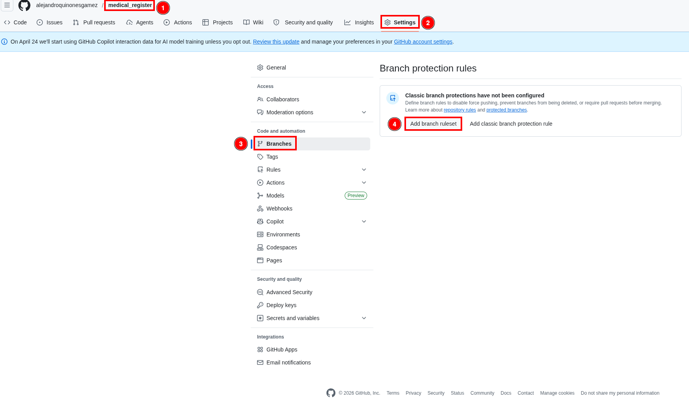
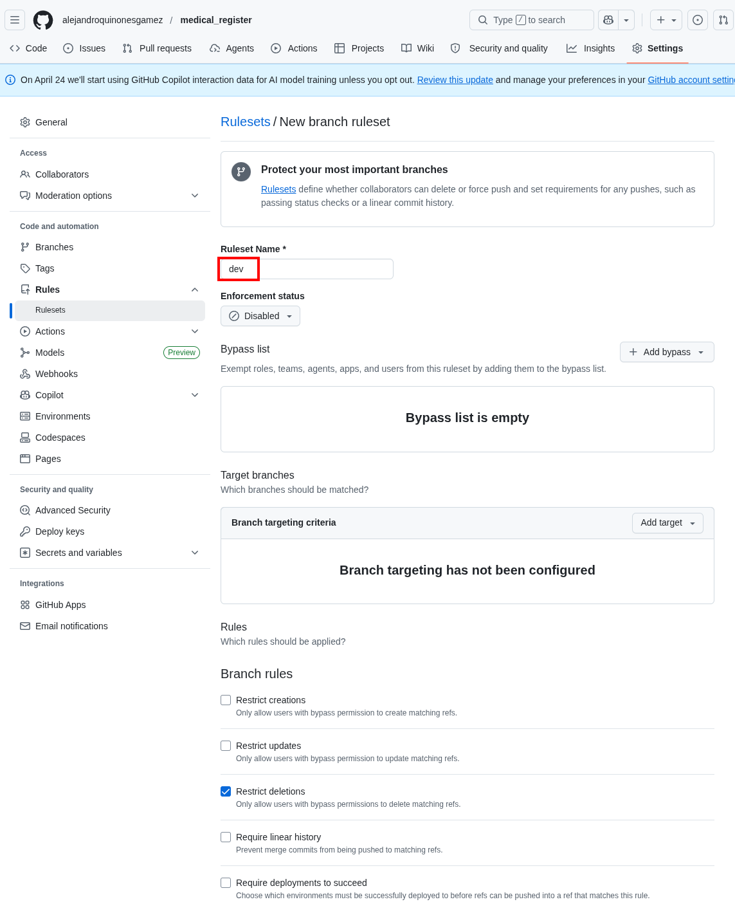
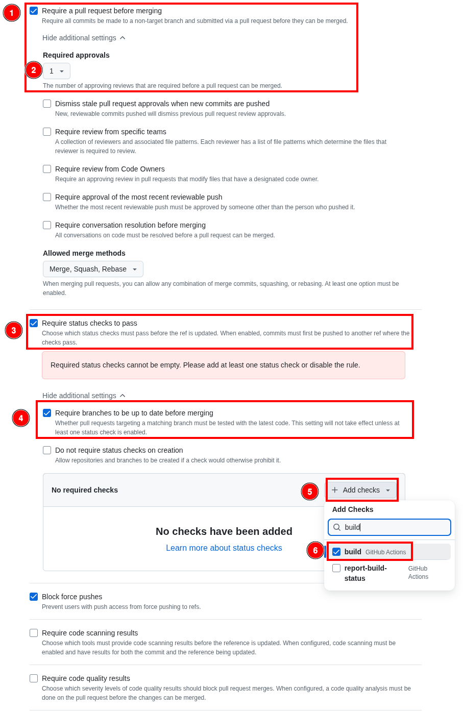
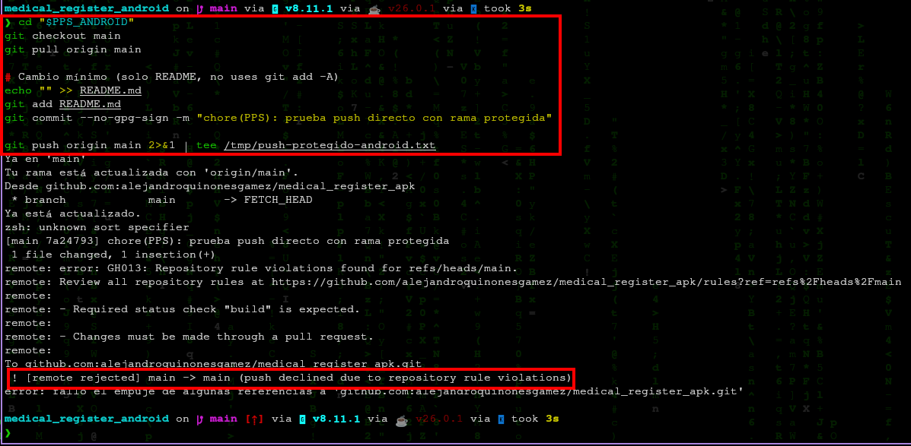
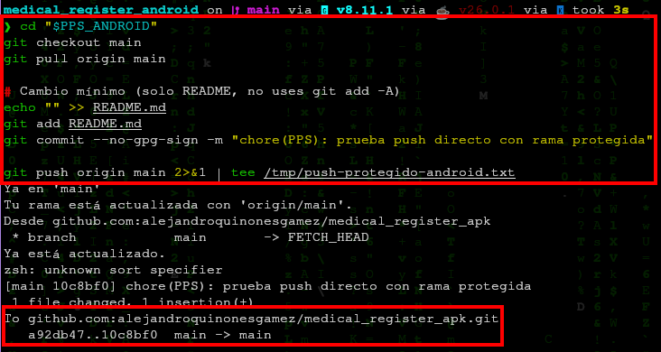
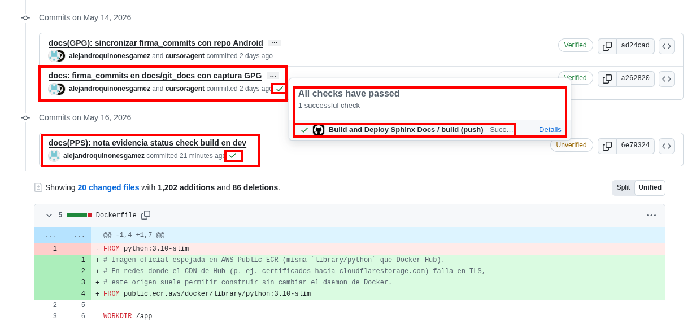

# Protección de ramas (Branch protection rules)

**Autores**: Alejandro Quiñones Gámez & Adrián Bertos Gómez

**Asignatura**: PPS — Puesta a Producción Segura

**Curso**: Curso de Especialización en Ciberseguridad en Tecnologías de la Información

**Centro**: IES Zaidín-Vergeles

> **Nota (evidencia)**: en `medical_register`, la rama `dev` exige el *status check* `build` (workflow *Build and Deploy Sphinx Docs*) antes de fusionar.

---

## Repositorios de este trabajo

| Proyecto | Repositorio GitHub | Remoto `origin` (SSH) | Rama habitual |
|---|---|---|---|
| Cliente Android | [medical_register_apk](https://github.com/alejandroquinonesgamez/medical_register_apk) | `git@github.com:alejandroquinonesgamez/medical_register_apk.git` | `main` |
| Backend | [medical_register](https://github.com/alejandroquinonesgamez/medical_register) | `git@github.com:alejandroquinonesgamez/medical_register.git` | `dev` |

Las reglas de protección se configuran **en GitHub**, en el repositorio remoto que corresponda (`medical_register_apk` y/o `medical_register`). El ejemplo de push directo bloqueado (§3.3) debe usar la **rama que hayáis protegido** (`main` en Android, `dev` o `main` en el backend).

```bash
# Ejemplo: push directo a main en el cliente Android (debe fallar si main está protegida)
cd medical_register_apk   # raíz del clone
git push origin main
```

---

## 1. Introducción

Las **reglas de protección de ramas** en GitHub (o equivalentes en GitLab: *Protected branches*) imponen restricciones sobre ramas críticas (`main`, `master`, `release/*`, etc.). El enunciado pide activar **revisiones obligatorias** y **comprobaciones de estado** (*status checks*) en la rama principal, y documentar el comportamiento **sin** necesidad de capturar datos sensibles del repositorio.

Documentación oficial:

- [About protected branches](https://docs.github.com/en/repositories/configuring-branches-and-merges-in-your-repository/managing-protected-branches/about-protected-branches)  
- [Managing a branch protection rule](https://docs.github.com/en/repositories/configuring-branches-and-merges-in-your-repository/managing-protected-branches/managing-a-branch-protection-rule)

---

## 2. Características (resumen del enunciado)

| Característica | Efecto |
|---|---|
| **Evitar modificaciones directas** | Impide `git push` directo a la rama protegida; los cambios entran vía **Pull Request** (o *merge queue* si está habilitada). |
| **Revisiones obligatorias** | Exige uno o más **aprobaciones** de revisores antes de fusionar (*code review*). |
| **Status checks** | Exige que jobs de CI (tests, Gitleaks, build de docs, etc.) finalicen en **éxito** antes de habilitar el merge. |

---

## 3. Actividad: configuración recomendada en GitHub

Ruta típica en el repositorio:

**Settings → Branches → Branch protection rules → Add rule** (o *Add branch protection rule*).

### 3.1. Ámbito de la regla

- **Branch name pattern**: la rama que uséis como principal en **ese** remoto. En **`medical_register_apk`** suele ser `main`; en **`medical_register`** (backend) el trabajo cotidiano suele estar en `dev` (ajusta el patrón a `dev` si protegéis esa rama en lugar de `main`).

### 3.2. Opciones mínimas alineadas con el enunciado

1. **Require a pull request before merging**  
   - Activar **Require approvals** (al menos **1** en equipos pequeños; más en producción).  
   - Opcional: *Dismiss stale pull request approvals when new commits are pushed*.

2. **Require status checks to pass before merging**  
   - Activar **Require branches to be up to date before merging** (recomendado).  
   - En el buscador de checks, seleccionar los jobs que ya existan en el repo, por ejemplo los definidos en `.github/workflows/coverage.yml` y `build-docs.yml` (los nombres exactos aparecen en la pestaña **Actions** tras una ejecución).

3. **Do not allow bypassing the above settings**  
   - Desactivar bypass para administradores si la política del curso lo exige (así la regla aplica a todos).

Opciones adicionales habituales en PPS:

- **Require conversation resolution before merging** (cerrar todos los hilos de comentario).  
- **Require linear history** (evita merge commits si se prefiere *rebase*/*squash*).  
- **Lock branch** solo en situaciones excepcionales (congelación de release).

En **`medical_register`** (backend) se configuró la regla sobre la rama **`dev`**: PR obligatorio, aprobaciones y *status check* **`build`** (*Build and Deploy Sphinx Docs*):







### 3.3. Cómo documentar el funcionamiento

1. **Intento de push directo** (debe fallar). Sustituye rama y repositorio según el caso (`main` en Android, `dev` en el backend si es la rama protegida):

   ```bash
   cd medical_register_apk   # raíz del clone del cliente Android
   git checkout main
   git pull origin main
   echo "# test" >> README.md
   git commit -am "chore: demo proteccion rama"
   git push origin main
   ```

   Resultado esperado: `remote: error: GH006: Protected branch update failed...` o mensaje equivalente de GitHub indicando que la rama está protegida.

   En **`medical_register_apk`** (rama **`main`** protegida):

   

   > Si en algún momento el push directo a `main` fue aceptado (antes de activar la regla o con bypass), puede quedar `push-aceptado-android.png` como contraste; la evidencia principal es el **rechazo** con la regla activa.

   

2. **Flujo correcto**: crear rama, abrir PR hacia la rama protegida, esperar checks verdes y aprobación, fusionar desde la UI (o con *merge queue* si aplica).

   Pull Request hacia **`dev`** en el backend: el job **`build`** aparece en verde en **Checks**:

   

   No se incluyen capturas dedicadas de PR bloqueado / listo para merge: la evidencia del enunciado queda cubierta con la regla en `dev` (§3.2), el check **`build`** en PR y el push directo bloqueado en Android.

---

## 4. Relación con otros ejercicios PPS

- **Gitleaks / Semgrep**: si sus workflows publican checks con nombre estable, pueden formar parte de los *status checks* obligatorios.  
- **GitHub Secret scanning / Push protection**: son políticas a nivel de código y seguridad, no sustituyen la revisión humana ni los tests.

---

**Autores**: Alejandro Quiñones Gámez & Adrián Bertos Gómez

**Asignatura**: PPS — Puesta a Producción Segura

**Curso**: Curso de Especialización en Ciberseguridad en Tecnologías de la Información

**Centro**: IES Zaidín-Vergeles
