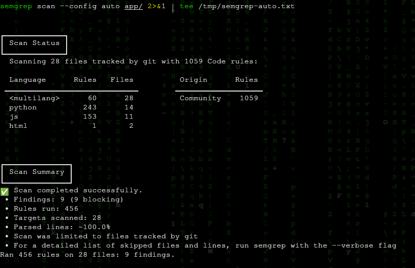
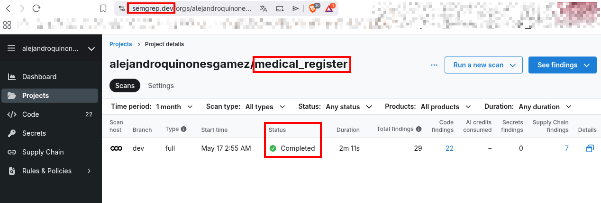
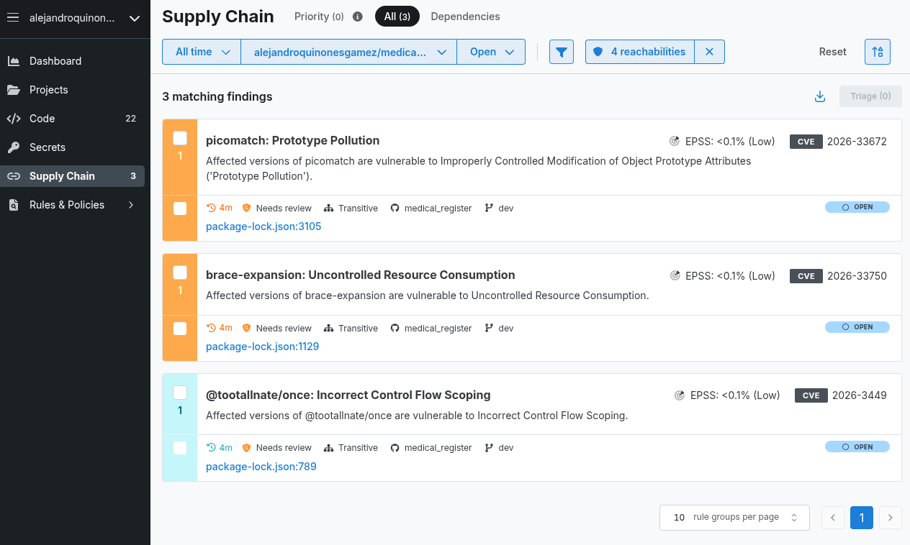
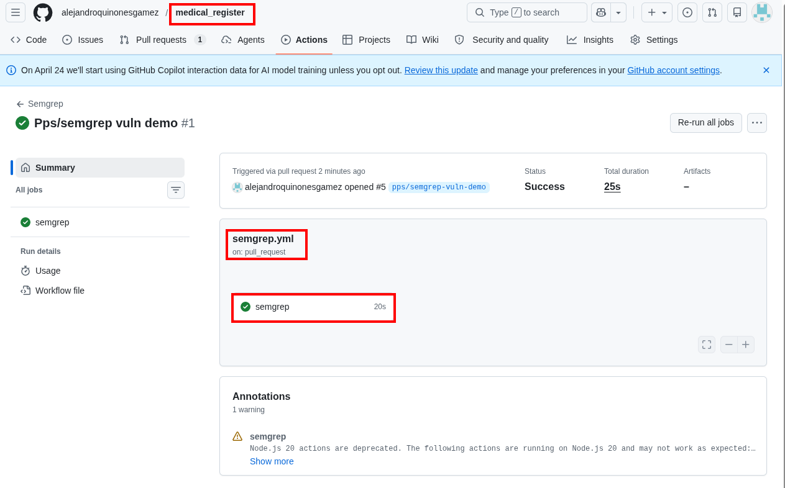
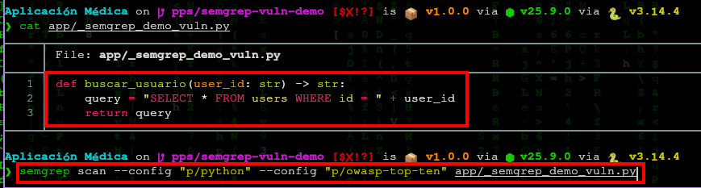
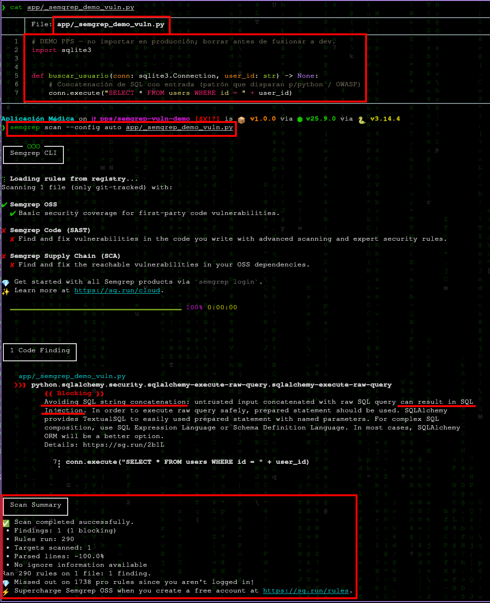

# Semgrep — SAST y reglas personalizadas

**Autores**: Alejandro Quiñones Gámez & Adrián Bertos Gómez

**Asignatura**: PPS — Puesta a Producción Segura

**Curso**: Curso de Especialización en Ciberseguridad en Tecnologías de la Información

**Centro**: IES Zaidín-Vergeles

**Enunciado**: `docs/git_docs/PPS_git/semgrep.html` (Fernando Raya, 2026-04-22)

---

## Repositorios de este trabajo

| Proyecto | Repositorio GitHub | Remoto `origin` (SSH) | Rama habitual |
|---|---|---|---|
| Cliente Android | [medical_register_apk](https://github.com/alejandroquinonesgamez/medical_register_apk) | `git@github.com:alejandroquinonesgamez/medical_register_apk.git` | `main` |
| Backend | [medical_register](https://github.com/alejandroquinonesgamez/medical_register) | `git@github.com:alejandroquinonesgamez/medical_register.git` | `dev` |

Semgrep y los workflows del §6 suelen aplicarse al **backend** (Python/Flask bajo `app/`). El cliente Android (Kotlin) puede escanearse por separado desde su propio directorio si la práctica lo pide.

---

## 1. Introducción

[Semgrep](https://semgrep.dev/) (*semantic grep*) es un analizador estático (**SAST**) que busca patrones en el **árbol sintáctico** (AST), no solo texto plano. Permite detectar vulnerabilidades recurrentes (inyecciones, configuraciones inseguras, APIs obsoletas), reglas de cumplimiento y, con configuraciones ampliadas, solaparse con detección de secretos o cadena de suministro según el conjunto de reglas.

El enunciado pide: **integrar Semgrep**, registrarse en la plataforma, probar opciones gratuitas, **introducir una vulnerabilidad de prueba** y documentar su detección, y **crear una regla personalizada** (o excluir directorios).

Referencias:

- [Quickstart (CLI)](https://semgrep.dev/docs/getting-started/quickstart)  
- [Quickstart — Scan your project](https://semgrep.dev/docs/getting-started/quickstart) (flujo sin cuenta GitHub/GitLab si aplica)  
- [Managed scans](https://semgrep.dev/docs/getting-started/quickstart-managed-scans#add-projects-to-semgrep-managed-scans)  
- [Add Semgrep to CI](https://semgrep.dev/docs/deployment/add-semgrep-to-ci)

---

## 2. Qué aporta (resumen del enunciado)

| Ventaja | Descripción breve |
|---|---|
| Detección de vulnerabilidades | Patrones inseguros por lenguaje (p. ej. SQL dinámico mal construido). |
| Cumplimiento | Reglas alineadas con estándares internos o *OWASP*. |
| Personalización | Reglas YAML cercanas al código fuente. |
| Velocidad | Motor optimizado frente a SAST clásicos más pesados. |

---

## 3. Escaneo manual local

Instalación típica (ver documentación actual):

```bash
python3 -m pip install semgrep
# o binario / contenedor según https://semgrep.dev/docs/getting-started/quickstart
```

Escaneo rápido con reglas recomendadas automáticamente:

```bash
# Raíz del clone de medical_register
semgrep scan --config auto
```

Enfoque web / APIs Python del enunciado:

```bash
semgrep scan --config "p/python" --config "p/owasp-top-ten"
```

> Los identificadores exactos de los packs en el registro pueden evolucionar; comprobar en [Semgrep Registry](https://semgrep.dev/r). El enunciado HTML cita `p/owasp-top-10`, pero en el registro actual el pack es **`p/owasp-top-ten`** ([OWASP Top Ten](https://semgrep.dev/p/owasp-top-ten)); `p/owasp-top-10` devuelve HTTP 404.

Escaneo de `app/` con `--config auto` en este repositorio: **28 ficheros** rastreados por git, **456 reglas** ejecutadas, **9 findings** (todos blocking) en Python, JavaScript y HTML.



---

## 4. Escaneos gestionados (*managed scans*)

Permiten ejecutar análisis **sin** montar infraestructura propia. Requieren conectar el repositorio (GitHub, GitLab, Bitbucket, Azure DevOps según el enunciado) y seguir el asistente de **managed scans** en la documentación enlazada.

**Prueba en este trabajo**: cuenta en [semgrep.dev](https://semgrep.dev), proyecto **`alejandroquinonesgamez/medical_register`**, rama **`dev`**. Escaneo gestionado **Completed** (~2 min): **29 findings** (22 *Code*, 0 *Secrets*, 7 *Supply Chain*). Detalle de dependencias transitivas en `package-lock.json`:





---

## 5. Regla personalizada de ejemplo

El enunciado sugiere prohibir `print()` en producción; en backend Flask suele ser más útil una regla orientada a **debug activo** o **SECRET_KEY** débil. Dos ejemplos:

### 5.1. Regla tipo enunciado (`no-print`)

Archivo `semgrep-rules/no-print.yaml`:

```yaml
rules:
  - id: no-print-in-prod
    patterns:
      - pattern: print(...)
    message: "No uses print() en código de producción; usa logging."
    languages: [python]
    severity: WARNING
```

Ejecución:

```bash
semgrep scan --config semgrep-rules/no-print.yaml app/
```

### 5.2. Regla más útil para Flask (ejemplo académico)

Detectar `app.run(debug=True)`:

```yaml
rules:
  - id: flask-debug-true
    patterns:
      - pattern: app.run(..., debug=True, ...)
    message: "No dejes debug=True en código fusionado a main."
    languages: [python]
    severity: ERROR
```

---

## 6. Integración en CI/CD (GitHub Actions)

El enunciado incluye un workflow con imagen `semgrep/semgrep` y comando `semgrep ci`, usando `SEMGREP_APP_TOKEN` para la **Semgrep AppSec Platform**:

```yaml
name: Semgrep

on:
  pull_request: {}
  workflow_dispatch: {}
  push:
    branches: [main, master, dev]
    paths:
      - .github/workflows/semgrep.yml
  schedule:
    - cron: "20 17 * * *"

permissions:
  contents: read

jobs:
  semgrep:
    name: semgrep/ci
    runs-on: ubuntu-latest
    container:
      image: semgrep/semgrep
    if: (github.actor != 'dependabot[bot]')
    steps:
      - uses: actions/checkout@v4
      - run: semgrep ci
        env:
          SEMGREP_APP_TOKEN: ${{ secrets.SEMGREP_APP_TOKEN }}
```

**Notas prácticas:**

1. Crear el token en Semgrep **Settings** y guardarlo como secreto del repositorio `SEMGREP_APP_TOKEN`.  
2. Si el plan gratuito **no** incluye `semgrep ci` conectado a la nube, documentar la alternativa: `semgrep scan --config auto --error` en CI sin token.  
3. Ajustar el `cron` a una hora aleatoria distinta para no concentrar carga.

En este trabajo el workflow corre en el PR `pps/semgrep-vuln-demo` (#1) con resultado **Success** (sin `SEMGREP_APP_TOKEN`; escaneo con reglas del repo):



> No se incluye captura de run en rojo en CI: la detección de la vulnerabilidad de prueba se documenta en CLI (`vuln-scan.png`, §7.1), suficiente frente al enunciado.

---

## 7. Actividad práctica (resolución)

### 7.1. Vulnerabilidad de prueba

**Rama**: `pps/semgrep-vuln-demo` (PR hacia `dev` en `medical_register`).

**Fichero demo**: `app/_semgrep_demo_vuln.py` (solo para evidencia; eliminar antes de fusionar a `dev`).

```python
import sqlite3

def buscar_usuario(conn: sqlite3.Connection, user_id: str) -> None:
    conn.execute("SELECT * FROM users WHERE id = " + user_id)
```

**Lección práctica**: una versión inicial solo devolvía la cadena SQL (`return query`) sin llamar a `execute()`. Con `p/python` + `p/owasp-top-ten` el escaneo terminó con **0 findings** (156 reglas, 1 fichero). Tras mover la concatenación a `conn.execute(...)`, `--config auto` detectó el patrón:

| Campo | Valor |
|---|---|
| Regla | `python.sqlalchemy.security.sqlalchemy-execute-raw-query.sqlalchemy-execute-raw-query` |
| Severidad | Blocking |
| Línea | 7 (`conn.execute(...)`) |

**Pack OWASP**: el enunciado cita `p/owasp-top-10`; en el registro vigente el id es `p/owasp-top-ten` (`p/owasp-top-10` → HTTP 404).



```bash
semgrep scan --config auto app/_semgrep_demo_vuln.py
```



### 7.2. Regla personalizada y exclusiones

- **Regla propia**: `semgrep-rules/no-flask-debug.yaml` (`flask-debug-true` — prohíbe `app.run(..., debug=True, ...)`).  
- **Exclusiones**: `.semgrepignore` excluye `tests/` y carpetas demo de otros apartados PPS (`_demo_gitleaks/`, `_demo_github/`).  
- **CI sin token de nube**: `.github/workflows/semgrep.yml` — reglas del repo en cada PR/push a `dev`; job adicional OWASP solo si el PR incluye el fichero demo.

**Artefactos en el repositorio**:

| Ruta | Rol |
|---|---|
| `semgrep-rules/no-flask-debug.yaml` | Regla personalizada (debug Flask) |
| `.semgrepignore` | Excluye `tests/` y demos PPS |
| `.github/workflows/semgrep.yml` | CI: reglas del repo; OWASP en PR si existe el demo |
| `app/_semgrep_demo_vuln.py` | Solo en rama de práctica; **no** debe quedar en `dev` tras el merge (se eliminó antes de fusionar) |

**Flujo documentado**: escaneo amplio de `app/` (§3) → rama `pps/semgrep-vuln-demo` con vulnerabilidad de prueba → regla propia + CI (§6) → `git rm app/_semgrep_demo_vuln.py` antes de fusionar a `dev`.

---

**Autores**: Alejandro Quiñones Gámez & Adrián Bertos Gómez

**Asignatura**: PPS — Puesta a Producción Segura

**Curso**: Curso de Especialización en Ciberseguridad en Tecnologías de la Información

**Centro**: IES Zaidín-Vergeles
