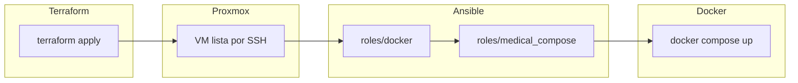

# Ansible — Configuración y despliegue Docker (Aplicación Médica)

**Autores**: Alejandro Quiñones Gámez & Adrián Bertos Gómez

**Asignatura**: PPS — Puesta a Producción Segura

**Curso**: Curso de Especialización en Ciberseguridad en Tecnologías de la Información

**Centro**: IES Zaidín-Vergeles

---

## 1. Introducción

Este documento describe el **módulo Ansible** bajo `terraform/aplicacion-medica/ansible/`,
que configura la **VM ya creada por Terraform** (Proxmox): instala **Docker Engine** y
**Compose v2**, sincroniza el repositorio **Aplicación Médica** en la VM y ejecuta
**`docker compose up`** según el `docker-compose.yml` de la raíz del repo.

A continuación se explica **qué hace cada rol y cada fichero relevante**, cómo se
controlan los **perfiles** de Compose (`medical_compose_profiles`), qué queda
ejecutándose por defecto y cómo validar el despliegue. El aprovisionamiento de la VM
está en **[Terraform.md](Terraform.md)**. Las capturas enlazadas más abajo usan la
carpeta **`docs/terraform/img/`** (rutas relativas `img/…` desde este fichero).

### 1.1. Qué es Ansible (resumen operativo)

Ansible aplica **playbooks** contra inventarios de hosts usando **módulos**
idempotentes (apt, file, template, command, etc.). No hace falta instalar un agente
en la VM: solo **SSH** y Python en el remoto (el intérprete se descubre al hacer
*gathering facts*).

### 1.2. Ficheros y roles del módulo

| Ruta / elemento | Función |
|---|---|
| `site.yml` | Play único: `hosts: medical`, `become: true`, roles **`docker`** y **`medical_compose`** en ese orden. |
| `inventory.ini` | Inventario real (no versionado): grupo `[medical]` con `ansible_host`, `ansible_user`, `ansible_ssh_private_key_file`. |
| `inventory.ini.example` | Plantilla mínima de inventario. |
| `ansible.cfg` | Ajustes del proyecto (véase **1.3**). |
| `requirements.yml` | Declara la colección **`ansible.posix`** (necesaria para `synchronize`). |
| `extra_vars.example.yml` | Plantilla: solo **`medical_app_source`** (ruta al repo). |
| `extra_vars.full.example.yml` | Plantilla **despliegue completo**: `medical_app_source` + **`medical_compose_profiles: [defectdojo]`**. |
| `roles/docker/tasks/main.yml` | Instalación de Docker CE y plugin Compose v2 desde el repo oficial de Docker para Debian. |
| `roles/medical_compose/` | Sincronización del código, red `proxy-network`, `.env`, script shell generado y ejecución de Compose. |

> ⚠️ **Inconveniente**: el playbook depende de **red** en la VM (`apt`, `get_url`,
> pulls de imágenes, `pip` dentro del build de `web`). En redes filtradas pueden
> aparecer **timeouts**; el rol `docker` incluye omisión condicional de la GPG y
> **reintentos** en la descarga cuando aplica.

### 1.3. Contenido de `ansible.cfg`

| Sección / clave | Valor | Efecto |
|---|---|---|
| `[defaults]` `inventory` | `inventory.ini` | Si ejecutas `ansible-playbook` sin `-i`, usa ese fichero. |
| `[defaults]` `host_key_checking` | `false` | No bloquea el primer SSH por huella desconocida (adecuado en **laboratorio**; en producción convendría `true` y `known_hosts` gestionado). |
| `[defaults]` `retry_files_enabled` | `false` | No deja `.retry` en fallos. |
| `[defaults]` `command_warnings` | `false` | Reduce avisos ruidosos de comandos shell. |
| `[privilege_escalation]` `become` | `true` | Las tareas que lo requieran usan `sudo` por defecto (el playbook ya pone `become: true`). |

### 1.4. Valores por defecto del rol `medical_compose` (`defaults/main.yml`)

| Variable | Valor por defecto | Significado |
|---|---|---|
| `medical_app_deploy_path` | `/opt/aplicacion-medica` | Directorio en la VM donde vive una copia del repo. |
| `medical_compose_project_name` | `medical_register` | `COMPOSE_PROJECT_NAME` (coherente con `docker-compose.env.example`). |
| `medical_compose_profiles` | `[]` | Lista de **`--profile`** de Compose. **Vacía** ⇒ solo servicios **sin** cláusula `profiles:` (**`web`** + **`waf`**). Para DefectDojo hay que pasar **`[defectdojo]`** (véase sección 2.5). |
| `medical_flask_env` | `production` | Inyectado en `.env` vía `blockinfile` (bloque Ansible). |
| `medical_app_supervisor` | `"0"` | Inyectado en `.env`; desactiva el supervisor de tráfico/DB en servidor (coherente con comentarios del `docker-compose.yml`). |

---

## 2. Qué se despliega con Ansible y de qué manera

**Resumen — despliegue completo (PPS):** en Terraform, **`deployment_mode = "full"`**
dimensiona la VM para soportar **DefectDojo** además de **waf** y **web**. En Ansible,
hay que definir **`medical_compose_profiles: [defectdojo]`** (plantilla
[`extra_vars.full.example.yml`](../../terraform/aplicacion-medica/ansible/extra_vars.full.example.yml).
Sin ese perfil, el playbook levanta solo **`web`** + **`waf`**.

### 2.1. Mecanismo (orden real de ejecución)

1. **`ansible-playbook site.yml`** contra el grupo **`medical`** con `become: true`.
2. **`roles/docker`**: prepara APT, clave y `sources` de Docker, instala paquetes
   `docker-ce`, `docker-ce-cli`, `containerd.io`, `docker-buildx-plugin`,
   `docker-compose-plugin` y arranca el servicio **`docker`**.
3. **`roles/medical_compose`**: tareas descritas en detalle en la **sección 3.4**.
4. El script **`/usr/local/bin/aplicacion-medica-compose-up.sh`** (plantilla
   `deploy_compose.sh.j2`) hace `cd` al despliegue y ejecuta
   `docker compose … up -d --build` con `COMPOSE_DOCKER_CLI_BUILD=0`,
   `DOCKER_BUILDKIT=0` y `COMPOSE_PROJECT_NAME={{ medical_compose_project_name }}`. Si
   `medical_compose_profiles` no está vacío, añade **`--profile <nombre>`** por cada
   elemento de la lista.

La definición de **servicios, imágenes, puertos y dependencias** está solo en
**`docker-compose.yml`** del repositorio de la aplicación; Ansible no redefine el
stack, solo prepara disco y entorno y lanza Compose.

### 2.2. Servicios en marcha sin perfiles Compose

Con **`medical_compose_profiles`** vacío (por defecto), Compose arranca los
servicios **sin** `profiles:` en el YAML:

| Servicio | Cómo se obtiene | Función |
|---|---|---|
| **`web`** | `build: .` | Imagen construida desde el `Dockerfile` del repo; Gunicorn en **5001/tcp** dentro de la red de contenedores. |
| **`waf`** | Imagen `owasp/modsecurity-crs:nginx-alpine` | Proxy **ModSecurity + CRS**; publica **`5001:8080`** en el host ⇒ acceso típico **`http://<IP_VM>:5001`**. |

**`waf`** tiene **`depends_on: web`** con condición **`service_healthy`**: hasta que
`web` pase el healthcheck interno, el WAF no estabiliza.

#### Evidencia sugerida: API detrás del WAF en el navegador

Con el playbook terminado y los contenedores en marcha, abre en el navegador del PC
de prácticas `http://<IP_VM>:5001/` (sustituye `<IP_VM>` por la salida de
`terraform output vm_ip_address`).


### 2.3. Datos y `.env`

Si **no** existe `.env` en la VM, se copia desde **`docker-compose.env.example`**
(`remote_src` en el mismo árbol). Se inserta un bloque con **`FLASK_ENV`** y
**`APP_SUPERVISOR`** y se fuerza modo **`0644`** en el fichero para que el usuario
**`appuser` (UID 1000)** del contenedor `web` pueda leer **`/app/.env`** (bind mount
`.:/app`). El **`rsync`** **excluye** `.env` para no pisar secretos desde el
portátil en sucesivas ejecuciones.

**`STORAGE_BACKEND`** en Compose cae por defecto en **`sqlite`** si no se define en
`.env` (laboratorio sin PostgreSQL “global” de la app en el stack mínimo).

### 2.4. ¿“Totalmente funcional”?

| Alcance | Tras playbook OK |
|---|---|
| **API + WAF** | Sí en condiciones normales (contenedores **healthy**, red a la VM). |
| **DefectDojo + dependencias** | Solo con **`medical_compose_profiles`** que incluya **`defectdojo`**. |
| **Producción / HTTPS / secretos fuertes** | No; requiere trabajo adicional manual o otras herramientas. |
| **Cliente Android** | No; hay que configurar la URL base hacia la VM. |

### 2.5. Variable `medical_compose_profiles` (perfiles Compose)

No existe un flag `--all` en CLI: la variable es una **lista YAML** o un **JSON** en
`-e`.

| Dónde definirla | Ejemplo |
|---|---|
| `extra_vars.yml` | `medical_compose_profiles: [defectdojo]` |
| Línea de órdenes | `-e '{"medical_compose_profiles":["defectdojo"]}'` |
| `group_vars` / `host_vars` | Misma clave en YAML del grupo `medical` |

**Perfiles** definidos en `docker-compose.yml` (resumen): **`defectdojo`** (stack
DefectDojo + `wstg-sync` asociado), **`tests`** (`frontend-tests`), **`local`**
(frontend alternativo; **conflictivo** con el puerto **5001** del `waf` si se
mezcla sin criterio).

**Recursos**: con **`deployment_mode = "full"`** en Terraform se orienta la VM a
**16G / 6 vCPU / 80G** salvo overrides en `terraform.tfvars`. Si la VM sigue con menos
RAM (p. ej. `vm_memory_mb` explícito antiguo), **no** actives `defectdojo` hasta
redimensionar o aplicar un nuevo `terraform apply`.

#### Coordinación Terraform + Ansible (DefectDojo)

1. `terraform apply` con recursos acordes (salida **`effective_vm_sizing`**).
2. `ansible-playbook … -e @extra_vars.yml` donde `extra_vars.yml` incluya
   **`medical_compose_profiles: [defectdojo]`** (o copia desde
   `extra_vars.full.example.yml`).

#### Evidencia sugerida: DefectDojo en el navegador (solo con perfil activo)

Si levantaste el perfil **`defectdojo`**, la interfaz web del stack suele estar en
**`http://<IP_VM>:8080/`** (nginx de DefectDojo). Si no
usáis ese perfil, podéis **no** generar esta imagen (el enlace quedará vacío en el
visor Markdown hasta que exista el fichero).


---

## 3. Detalle de inventario, variables y roles

### 3.1. Inventario y conexión

Copia `inventory.ini.example` → `inventory.ini` y rellena **`ansible_host`** con la
IP de **`terraform output vm_ip_address`** (o la línea `ansible_inventory_line`).

**Problema frecuente**: rutas con **espacios** en `ansible_ssh_private_key_file` **sin
comillas** rompen el parser INI. Solución: **comillas dobles** alrededor de la ruta
completa.

### 3.2. Variable `medical_app_source`

Debe ser la ruta **absoluta** en la máquina que ejecuta Ansible al **directorio raíz
del repo** (donde están `docker-compose.yml` y el `Dockerfile`).

| Problema | Causa | Solución |
|---|---|---|
| Ruta troceada al usar `-e medical_app_source=/.../PPS - ...` | El shell parte el valor en espacios. | Usar **JSON** o **`-e @extra_vars.yml`** con la ruta entre comillas YAML. |
| `rsync` bajo `.../ansible/home/...` | Filtro **`trim('/')`** en Jinja quitaba la **/** inicial y la ruta pasaba a ser relativa al playbook. | En el rol se usa **`regex_replace('/$', '')`** solo para la barra final. |

### 3.3. Rol `docker` — tareas y efecto en la VM

Orden en `roles/docker/tasks/main.yml`:

| Orden | Tarea (resumen) | Efecto en la VM |
|---|---|---|
| 1 | `apt` update (caché 1 h) | Índice APT actualizado. |
| 2 | Instalar `ca-certificates` | Base para HTTPS a repos. |
| 3 | Crear `/etc/apt/keyrings` | Directorio para la clave GPG de Docker. |
| 4 | `stat` de `docker.asc` | Decide si hace falta bajar la clave. |
| 5 | `get_url` GPG Docker | Escribe `/etc/apt/keyrings/docker.asc` (con reintentos y timeout si aplica). |
| 6 | `copy` `docker.sources` | Añade el repo **Debian** de Docker (`Signed-By` apuntando a la clave). |
| 7 | `apt` instalar paquetes Docker | Instala motor, CLI, containerd, buildx y **plugin Compose v2**. |
| 8 | `service` docker | Servicio **habilitado y arrancado**. |

### 3.4. Rol `medical_compose` — tareas y efecto en la VM

| Orden | Tarea | Efecto |
|---|---|---|
| 1 | `assert` | Falla si falta `medical_app_source`. |
| 2 | `apt` `rsync` | Paquete rsync para `synchronize`. |
| 3 | `file` | Crea `medical_app_deploy_path` (0755). |
| 4 | `synchronize` push | Copia el repo desde el **controlador** a la VM; exclusiones: `.git`, cachés, **`.env`**, `.terraform`, etc. |
| 5 | `stat` + `fail` | Comprueba que exista `docker-compose.env.example` tras el rsync; si no, el playbook falla con mensaje claro. |
| 6 | `file` en bucle | Crea `data/waf`, `data/postgres`, `data/redis`, `data/defectdojo/media`, `data/defectdojo/static`. |
| 7 | `shell` | Crea la red Docker **`proxy-network`** si no existe (requerida porque en `docker-compose.yml` es `external: true`). |
| 8 | `copy` remoto | Crea `.env` desde `docker-compose.env.example` si no existe (`0644`). |
| 9 | `file` | Refuerza **0644** en `.env`. |
| 10 | `blockinfile` | Añade bloque marcado con `FLASK_ENV` y `APP_SUPERVISOR` (`mode: "0644"` en el módulo). |
| 11 | `file` | Vuelve a asegurar **0644** tras el bloque. |
| 12 | `template` | Genera `/usr/local/bin/aplicacion-medica-compose-up.sh`. |
| 13 | `command` + `debug` | Ejecuta ese script y muestra la salida estándar en el recap de Ansible. |

**Problema `.env` Permission denied en `web`**: el contenedor corre como **appuser**;
sin **0644** en el `.env` del host, no puede leer el bind mount. Solución: tareas de
permiso + `mode` en `blockinfile` (véase tabla en **3.4**).

### 3.5. Colección `ansible.posix`

Instalación previa:

```bash
cd terraform/aplicacion-medica/ansible
ansible-galaxy collection install -r requirements.yml
```

Sin la colección, el módulo **`synchronize`** no está disponible.

---

## 4. Flujo mínimo de uso

1. Crear **`inventory.ini`** (IP, usuario, clave SSH entrecomillada si la ruta tiene espacios).
2. Crear **`extra_vars.yml`** (no versionado):
   - Solo API+WAF: copia [`extra_vars.example.yml`](../../terraform/aplicacion-medica/ansible/extra_vars.example.yml) y rellena `medical_app_source`.
   - **Completo** con DefectDojo: copia [`extra_vars.full.example.yml`](../../terraform/aplicacion-medica/ansible/extra_vars.full.example.yml) y ajusta la ruta.
3. Ejecutar:

```bash
cd terraform/aplicacion-medica/ansible
ansible-galaxy collection install -r requirements.yml
ansible-playbook site.yml -i inventory.ini -e @extra_vars.yml
```

#### Evidencia sugerida: conectividad Ansible y recap del playbook

Ejecuta **`ansible medical -m ping`** y **`ansible-playbook`** como arriba; captura
**éxito en ping** y el bloque **PLAY RECAP** con `failed=0`.


Más detalle operativo: `terraform/aplicacion-medica/README.md`.

---

## 5. Relación con Terraform



1. **Terraform** crea la VM (véase [Terraform.md](Terraform.md)).
2. **Ansible** instala Docker y levanta el stack (sección **2** de este documento).

---

## 6. Seguridad y buenas prácticas

- **`inventory.ini`** y **`extra_vars.yml`** pueden contener rutas a claves o datos
  sensibles: no publicarlos si no deben serlo.
- **`rsync` excluye `.env`**: los secretos se mantienen en la VM entre ejecuciones.
- **`.env` 0644** en la VM es un **compromiso de laboratorio** para el bind mount;
  endurecer implicaría otra estrategia (secrets de Docker, variables solo en
  `environment:` de Compose, etc.).

---

## 7. Validación

En la máquina de control:

```bash
cd terraform/aplicacion-medica/ansible
ansible-galaxy collection install -r requirements.yml
ansible medical -m ping -i inventory.ini
ansible-playbook site.yml -i inventory.ini -e @extra_vars.yml
```

En la VM (o vía `ansible … -m shell`):

```bash
sudo docker compose -f /opt/aplicacion-medica/docker-compose.yml ps
curl -sS -o /dev/null -w "HTTP:%{http_code}\n" http://127.0.0.1:5001/
```

Tras un despliegue correcto del stack **waf+web**, lo habitual es **`HTTP:200`** en
el puerto **5001** del host (servicio `waf`).

#### Evidencia sugerida: estado de contenedores y código HTTP

En la misma sesión SSH (o con `ansible medical -m shell`), deja visible el listado de
**`docker compose ps`** y la línea de **`curl`** con **`HTTP:200`**.


---

**Autores**: Alejandro Quiñones Gámez & Adrián Bertos Gómez

**Asignatura**: PPS — Puesta a Producción Segura

**Curso**: Curso de Especialización en Ciberseguridad en Tecnologías de la Información

**Centro**: IES Zaidín-Vergeles
