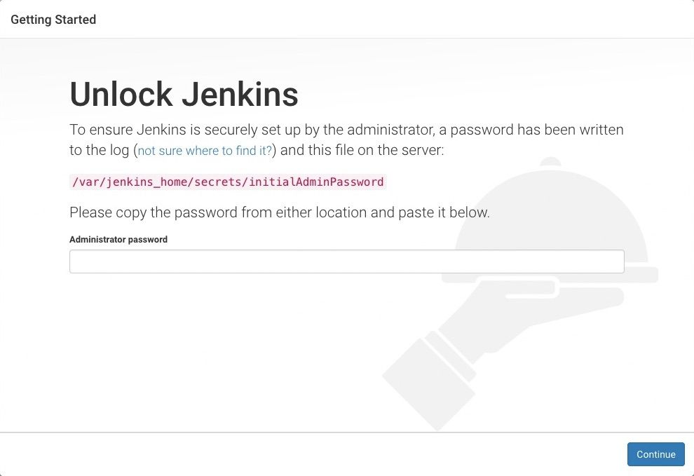
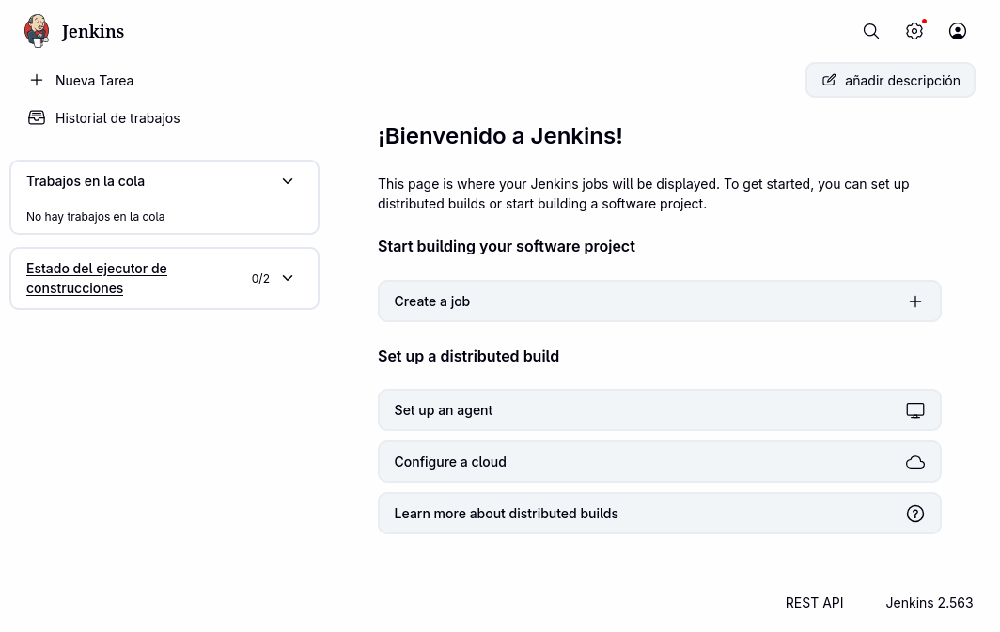

#+TITLE: Introducción a Jenkins
#+STARTUP: indent
#+EMAIL: <fraya@ieszaidinvergeles.org>
#+LANG: es
#+SETUPFILE: ~/Plantillas/white_clean.theme

* Objetivo

- Entender el papel de Jenkins en CI/CD, su arquitectura básica y cómo
  gestiona trabajos y builds.

- Conocer la interfaz de usuario y la importancia de plugins para
  mejorar la usabilidad.

* Conceptos Básicos

- [[https://www.jenkins.io/][Jenkins]] es un servidor de automatización open-source que facilita la
  integración continua (CI) y la entrega continua (CD) en el
  desarrollo de software.

- Automatiza tareas repetitivas como compilación, pruebas y
  despliegue, permitiendo a los equipos entregar software de alta
  calidad de forma rápida y confiable.

- Jenkins tiene una arquitectura modular con más de [[https://plugins.jenkins.io/][1.500 plugins]] que
  extienden su funcionalidad para integrarse con herramientas como
  Git, Docker, Kubernetes, etc.

* Historia y Evolución

- Originalmente llamado Hudson, fue renombrado a Jenkins en 2011 y
  desde entonces ha tenido un crecimiento exponencial en adopción y
  desarrollo.

- Es mantenido por una comunidad activa que aporta
  mejoras continuas y plugins para ampliar sus capacidades.

* Arquitectura y Componentes

- Jenkins funciona mediante /jobs/ (trabajos) que son tareas
  individuales configurables.

- Cada ejecución de un job se denomina /build/, y puede tener estados
  como /Success/, /Aborted/, /Canceled/ o /Error/.

- La interfaz de usuario web permite gestionar jobs, configurar
  plugins, y monitorizar el progreso de los pipelines.

- Se recomienda el uso de plugins como [[https://www.jenkins.io/doc/book/blueocean/][Blue Ocean]] para mejorar la
  experiencia de usuario y la gestión visual de pipelines (No cubierto
  en el curso).

* Instalación

Jenkins se empaqueta en un fichero WAR como una aplicación web junto a
un servidor de contenedores.

** Instalación con Docker

En general, lo más cómodo es instalarlo como un contenedor de Docker
desde la imagen [[https://hub.docker.com/r/jenkins/jenkins/][jenkins/jenkins]] en Docker Hub. Sin embargo esta imagen
no cuenta con el plugin Blue Ocean por lo que tendremos que hacer
ajustes.
 
#+caption: Crear una nueva red puente
#+begin_src bash
  docker network create jenkins
#+end_src

Para ejecutar comandos de Docker dentro del nodo Jenkins, primero
descargaremos la imagen ~docker:dind~ y luego la usaremos.
  
#+caption: Descargar la imagen
#+begin_src bash
  docker image pull docker:dind.
#+end_src

#+caption: 
#+begin_src bash
  docker run \
           --name jenkins-docker \
           --rm \
           --detach \
           --privileged \
           --network jenkins \
           --network-alias docker \
           --env DOCKER_TLS_CERTDIR=/certs \
           --volume jenkins-docker-certs:/certs/client \
           --volume jenkins-data:/var/jenkins_home \
           --publish 2376:2376 \
           docker:dind \
           --storage-driver overlay2
#+end_src

Configuraremos la imagen oficial de Jenkins con los plugins de Blue
Ocean, docker-ce-cli.

#+caption: Dockerfile
#+begin_src bash
  FROM jenkins/jenkins:2.555.1-jdk21
  USER root
  RUN apt-get update && apt-get install -y lsb-release ca-certificates curl && \
      install -m 0755 -d /etc/apt/keyrings && \
      curl -fsSL https://download.docker.com/linux/debian/gpg -o /etc/apt/keyrings/docker.asc && \
      chmod a+r /etc/apt/keyrings/docker.asc && \
      echo "deb [arch=$(dpkg --print-architecture) signed-by=/etc/apt/keyrings/docker.asc] \
      https://download.docker.com/linux/debian $(. /etc/os-release && echo \"$VERSION_CODENAME\") stable" \
      | tee /etc/apt/sources.list.d/docker.list > /dev/null && \
      apt-get update && apt-get install -y docker-ce-cli && \
      apt-get clean && rm -rf /var/lib/apt/lists/*
  USER jenkins
  RUN jenkins-plugin-cli --plugins "blueocean docker-workflow json-path-api"  
#+end_src

Crea una nueva imagen de docker a partir de este Dockerfile.

#+begin_src bash
  docker build -t myjenkins-blueocean:2.555.1-1 .
#+end_src

Ya podemos ejecutar nuestra propia imagen.

#+begin_src bash
  docker run \
    --name jenkins-blueocean \
    --restart=on-failure \
    --detach \
    --network jenkins \
    --env DOCKER_HOST=tcp://docker:2376 \
    --env DOCKER_CERT_PATH=/certs/client \
    --env DOCKER_TLS_VERIFY=1 \
    --publish 8080:8080 \
    --publish 50000:50000 \
    --volume jenkins-data:/var/jenkins_home \
    --volume jenkins-docker-certs:/certs/client:ro \
    myjenkins-blueocean:2.555.1-1  
#+end_src

** Instalación en Proxmox

Utilizaremos el /Community Script/ de [[https://community-scripts.org/scripts/jenkins][Jenkins]].

* Primeros pasos

** Desbloquear Jenkins

Al arrancar Jenkins (normalmente en el puerto ~8080~) encontraremos la
página que nos pregunta la contrasena generada automáticamente para
desbloquear la instalación.

#+caption: Desbloquear Jenkins
#+attr_html: :width 550px :align center

Accederemos al fichero en la MV de Proxmox

: cat /var/lib/jenkins/secrets/initialAdminPassword

o miraremos los logs en Docker

: docker logs jenkins-blueocean

** Instalar plugins

Podemos instalar los plugins sugeridos por defecto o seleccionar los
plugins que queremos.

En el caso de instalar Jenkins desde Proxmox, iremos a /Administrar
Jenkins/, luego a /Plugins/ e instalaremos *Blue Ocean (/BlueOcean
Aggregator/)*.

** Crear el primer usuario administrador

Luego crearemos un usuario administrador.

** Pantalla inicial

#+caption: Pantalla inicial
#+attr_html: :width 550px :align center

* Referencias

- https://www.jenkins.io/
- https://plugins.jenkins.io/
- https://es.wikipedia.org/wiki/Jenkins
- https://www.jenkins.io/doc/book/installing/
- https://community-scripts.org/scripts/jenkins
